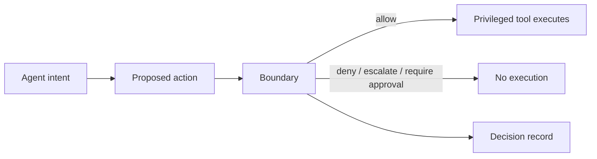
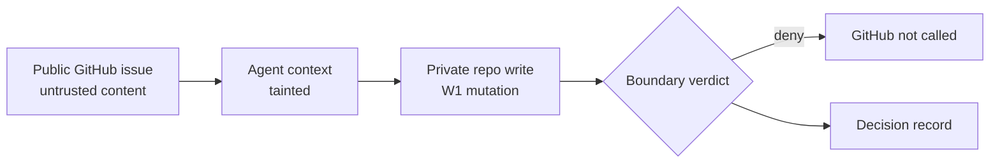

# Fulcrum Boundary

> The action boundary for MCP-native agents. See what your AI tools can do, block what they should not, and record every verdict before routed privileged execution.

[](https://pkg.go.dev/github.com/fulcrum-governance/fulcrum-boundary)
[](https://github.com/Fulcrum-Governance/Fulcrum-Boundary/actions/workflows/ci.yml)
[](https://goreportcard.com/report/github.com/fulcrum-governance/fulcrum-boundary)
[](./LICENSE)

## Try It In One Minute

Requires Go 1.25+.

```bash
go install github.com/fulcrum-governance/fulcrum-boundary/cmd/boundary@v0.3.0
boundary selftest
boundary demo github-lethal-trifecta
```

No credentials. No live GitHub calls. No real mutations.

[Quickstart](#try-it-in-one-minute) | [Demo](./docs/DEMO_GITHUB_LETHAL_TRIFECTA.md) | [Install](./docs/INSTALL.md) | [Claims](./docs/CLAIMS_LEDGER.md) | [Release Truth](./docs/RELEASE_TRUTH_PUBLIC.md)

## What is Fulcrum Boundary?

Fulcrum Boundary is the out-of-process action boundary for AI agents using privileged tools. As a Go library and gateway binary, it evaluates tool calls against trust state, static policies, domain interceptors, and a portable policy engine before those calls reach the underlying tool.

Boundary includes a production MCP adapter plus CLI, CodeExec, gRPC, Managed Agents, Webhook, A2A, and Secure GitHub preview adapter packages with maturity tracked per adapter. Direct tool calls are governed only when routed through Boundary and when the deployment topology prevents the agent from reaching the privileged tool directly.

Public language follows the Boundary lexicon and claim rules in
[`docs/LANGUAGE_SYSTEM.md`](./docs/LANGUAGE_SYSTEM.md),
[`docs/LEXICON.md`](./docs/LEXICON.md), and
[`docs/COPY_RULES.md`](./docs/COPY_RULES.md).

## What The Demo Shows

The first-run demo inventories a fixture MCP config, renders the risky GitHub
write-after-taint path, generates starter policies, runs the Secure GitHub
preview fixture, denies the write before upstream mutation, and emits a
decision record.

Expected success signal:

```text
actual action: DENY
reason: lethal_trifecta_detected
upstream_called=false
```



Boundary sits before privileged execution. A tool call executes only after a
verdict, and only for routes that pass through Boundary.



Secure GitHub preview denies the tested fixture path before upstream GitHub
mutation.

## Install

Install the `boundary` CLI with Go:

Requires Go 1.25+.

```bash
go install github.com/fulcrum-governance/fulcrum-boundary/cmd/boundary@v0.3.0
boundary selftest
```

Or run from a clean source checkout:

```bash
git clone https://github.com/Fulcrum-Governance/Fulcrum-Boundary.git
cd Fulcrum-Boundary
go run ./cmd/boundary selftest
```

Full install and uninstall notes are in [`docs/INSTALL.md`](./docs/INSTALL.md).

## Five-Minute Demo

This no-credential local path inventories a fixture MCP config, renders the
dangerous GitHub write-after-taint path, generates starter policies, verifies
those policies, runs the Secure GitHub fixture profile, red-teams the risky
flow, and writes a local dashboard artifact:

```bash
boundary demo github-lethal-trifecta
```

To inspect the same path step by step:

```bash
tmp=$(mktemp -d)
cp docs/firewall/fixtures/claude_desktop_config.json "$tmp/mcp.json"

boundary inventory --config "$tmp/mcp.json" --format markdown
boundary graph --config "$tmp/mcp.json" --format mermaid
boundary policy generate --out "$tmp/boundary-firewall-policies"
boundary verify --policies "$tmp/boundary-firewall-policies"

boundary secure github setup --out "$tmp/secure-github"
boundary secure github serve --fixture --dry-run
boundary redteam --pack github-lethal-trifecta
boundary dashboard --format html --out "$tmp/dashboard.html" \
  --config "$tmp/mcp.json" \
  --policies "$tmp/boundary-firewall-policies"
```

The flagship path starts with a poisoned GitHub issue fixture and ends with a
private-repo mutation denied before any upstream GitHub call. See
[`docs/DEMO_SCRIPT.md`](./docs/DEMO_SCRIPT.md) and
[`docs/YC_DEMO_NARRATIVE.md`](./docs/YC_DEMO_NARRATIVE.md).

## What This Proves

| Scope | What the demo shows |
|---|---|
| Inventory | Boundary can read fixture MCP client config and list reachable tools. |
| Risk graph | Boundary can connect untrusted GitHub context to a private-repo mutation path. |
| Starter policy | Boundary can generate verifiable local starter policies for reviewed use. |
| Secure GitHub preview | Boundary can deny the tested write-after-taint fixture before GitHub is touched. |
| Decision record | Boundary records the verdict and reason for the governed route. |

## What This Does Not Prove

| Limit | Why it matters |
|---|---|
| Universal prompt-injection defense | The fixture covers the tested write-after-taint path, not every possible malicious issue or agent behavior. |
| Production GitHub security | Secure GitHub remains preview until live GitHub App conformance and deployment bypass evidence are recorded. |
| Protection for direct tool calls | Boundary governs routed tools. Direct access to the same tool is a bypass path unless deployment topology blocks it. |
| Complete production policy | Generated policies are starter policies for operator review. |
| Hosted monitoring | The dashboard reads local artifacts only. |

Proof boundary: Boundary consumes proof-backed contracts through documented
correspondence and decision-mode boundaries. It does not emit `proved` decisions
itself. See [docs/PROOF_BOUNDARY.md](./docs/PROOF_BOUNDARY.md).

## MCP Firewall Local Visibility

Boundary can inventory local MCP client configs, render risk paths, generate
starter policies, install reversible Boundary routes, verify descriptor locks,
and show those local artifacts in a local-only dashboard:

```bash
boundary inventory --format markdown
boundary graph --format mermaid
boundary policy generate --out boundary-firewall-policies
boundary dashboard --format html --out .boundary/firewall/dashboard.html
```

See [docs/firewall/DASHBOARD.md](./docs/firewall/DASHBOARD.md). The dashboard
reads local files only; it is not hosted monitoring and does not protect MCP
servers by itself.

## Secure GitHub Preview

Secure GitHub is a preview Secure MCP profile for the write-after-taint demo.
It tracks fixture taint sources, classifies GitHub read and mutation tools, and
denies W1/W2 private-repo mutations after untrusted GitHub content enters the
agent context.

```bash
boundary secure github setup --out secure-github-fixture
boundary secure github serve --fixture --dry-run
boundary redteam --pack github-lethal-trifecta
```

This path is fixture-backed. Live GitHub App conformance and deployment bypass
proof are required before production status.

## Command Boundary Preview

Boundary can also govern project-local command paths when commands route through
`boundary command run`, `boundary shell`, or project-local shims.

```bash
boundary command classify -- git push origin main
boundary command run -- git status
boundary shell
```

This is preview. Direct shell access is outside Boundary unless the environment
routes commands through the wrapper or shims. See
[docs/command-boundary/DEMO.md](./docs/command-boundary/DEMO.md).

## GitHub Action

Boundary includes a repo-local MCP audit action for CI visibility:

```yaml
- uses: Fulcrum-Governance/Fulcrum-Boundary/actions/mcp-audit@v0.3.0
```

The action audits repository MCP configs and emits Markdown plus optional SARIF
reports. It is CI audit/reporting only; runtime protection still requires
governed routing through Boundary. See
[docs/firewall/GITHUB_ACTION.md](./docs/firewall/GITHUB_ACTION.md).

## MCP Safety Gateway / Postgres Demo

Run the launch demo from a clean clone:

```bash
make demo
```

The demo starts three containers:

- `demo-agent`: frontend network only
- `gateway`: frontend + backend networks
- `postgres`: backend-only internal network

Expected spine:

```text
1. Safe SELECT through Boundary
ALLOW status=200 ...

2. Destructive DROP TABLE through Boundary
DENY status=403 ... "matched_rule":"block-drop-table"

3. Direct bypass attempt to Postgres
BYPASS BLOCKED ...
```

For a local binary:

```bash
boundary --help
boundary verify --policies examples/mcp-postgres-gateway/policies
```

## Library Quick Start

```go
package main

import (
	"context"
	"fmt"

	"github.com/fulcrum-governance/fulcrum-boundary/governance"
)

func main() {
	cfg := governance.PipelineConfig{
		StaticPolicies: []governance.StaticPolicyRule{
			{Name: "block-rm", Tool: "rm", Action: "deny", Reason: "destructive"},
		},
	}
	pipeline := governance.NewPipeline(cfg, nil, nil, nil)

	req := &governance.GovernanceRequest{
		ToolName:  "rm",
		Transport: governance.TransportCLI,
		TenantID:  "tenant-1",
	}
	decision, err := pipeline.Evaluate(context.Background(), req)
	if err != nil {
		panic(err)
	}
	fmt.Printf("%s — %s\n", decision.Action, decision.Reason)
}
```

```
$ go run main.go
deny — destructive
```

## Architecture

```
Agent Request
     │
     ▼
┌─────────────────┐   Stage 1:  Trust / circuit-breaker check (optional)
│ TrustChecker    │            Isolated or Terminated → deny
└────────┬────────┘
         │
         ▼
┌─────────────────┐   Stage 2:  Static allow/deny rules on tool name
│ Static Policies │            Fastest path; no I/O
└────────┬────────┘
         │
         ▼
┌─────────────────┐   Stage 3:  Domain-specific interceptors by tool name
│  Interceptors   │            (e.g. SQL guard, filesystem whitelist)
└────────┬────────┘
         │
         ▼
┌─────────────────┐   Stage 4:  Portable PolicyEval engine
│   PolicyEval    │            Declarative rules with conditions
└────────┬────────┘
         │
         ▼
  GovernanceDecision  (allow | deny | warn | escalate | require_approval)
         │
         ▼
  AuditPublisher     Emitted on every evaluation, allow or deny
```

Every stage returns early on a terminal decision. Audit events fire regardless
of outcome.

## Adapters And Profiles

Boundary tracks adapter and profile maturity explicitly. See
[`docs/ADAPTER_READINESS_MATRIX.md`](./docs/ADAPTER_READINESS_MATRIX.md) and the
per-adapter `readiness.yaml` files for the ten-step lifecycle behind each row.

### Production

| Adapter | Package | Handles |
|---|---|---|
| MCP | `adapters/mcp` | HTTP JSON-RPC MCP proxying for `tools/call` and `tools/list`; allowed requests forward to an upstream MCP server, denied requests never reach upstream, and responses carry governance metadata |

### Preview

| Adapter | Package | Handles |
|---|---|---|
| CLI | `adapters/cli` | Shell commands including pipe chains, with wrapper-owned governed execution through `os/exec`; direct shell access remains outside Boundary unless deployment topology makes the wrapper the sole command path |
| Code exec | `adapters/codeexec` | Python, JavaScript, and TypeScript source submitted through a governed execution lifecycle with language, resource, filesystem, network, subprocess, and obfuscation checks; execution requires a configured boundary and is not described as secure sandboxing unless that boundary is real, named, tested, and documented |
| gRPC | `adapters/grpc` | gRPC unary calls via a server interceptor in a separate module, with governance trailers, response inspection, and explicit streaming limitations |
| Managed Agents | `adapters/managedagents` | Managed Agents session streams in preview proxy mode, with policy-driven tool confirmations, thread budget tracking, and a documented credential-bound bypass model; production status requires a live upstream conformance run |
| Webhook | `adapters/webhook` | HTTP webhook payloads in explicit informational audit mode or execution pre-approval mode; only execution mode can deny before forwarding |
| A2A | `adapters/a2a` | Agent-to-agent task/message envelopes in preview mode, with a documented protocol snapshot, governed forwarding, denial shaping, response inspection, governance metadata, and fail-closed handling for malformed or unsupported mandatory fields |
| Secure GitHub | `adapters/securegithub` | Secure MCP preview profile for fixture GitHub write-after-taint denial; live GitHub App conformance and bypass proof are required before production status |

Each adapter implements the `governance.TransportAdapter` interface. Adding a
new transport is a matter of satisfying that interface and declaring lifecycle
readiness — see
[`docs/ADAPTER_CONTRACT.md`](./docs/ADAPTER_CONTRACT.md) and
[ARCHITECTURE.md](./ARCHITECTURE.md#adding-a-new-transport-adapter).

The gRPC adapter lives in its own Go module under `adapters/grpc/` so that
`google.golang.org/grpc` does not propagate into the root dependency tree.
The other adapters use only stdlib and sibling packages.

## HTTP Middleware

Boundary ships an HTTP middleware for reverse-proxy deployments. Wrap any
downstream handler and every request is evaluated through the pipeline
before it is forwarded.

```go
middleware := governance.NewMiddleware(pipeline, downstream, governance.MiddlewareConfig{})
http.ListenAndServe(":8080", middleware)
```

Denied requests return HTTP 403 with a JSON body containing `action`, `reason`,
`decision_mode`, `matched_rule`, `policy_file`, `gateway_version`, and
`request_id`. Every response — allow or deny — carries `X-Governance-Action`,
`X-Governance-Reason`, `X-Governance-Matched-Rule`, and
`X-Governance-Envelope-ID` headers so clients can read the verdict without parsing the body. See
[`examples/http-middleware`](./examples/http-middleware).

By default, the middleware reads identity from `X-Governance-Agent-ID` and
`X-Governance-Tenant-ID`. For compatibility it also accepts legacy
`X-Agent-ID` / `X-Tenant-ID` inputs and normalizes forwarded requests so the
downstream handler sees the governance-prefixed headers.

## Logging

Boundary ships a `SlogAuditPublisher` that writes every governance decision as a
structured record. Allow and warn decisions log at `INFO`; deny, escalate,
and require-approval log at `WARN`.

```go
logger := slog.New(slog.NewJSONHandler(os.Stdout, nil))
auditor := governance.NewSlogAuditPublisher(logger)
pipeline := governance.NewPipeline(cfg, nil, nil, auditor)
```

All standard fields are attached as `slog.Attr` values (`request_id`,
`transport`, `tool_name`, `action`, `reason`, `decision_mode`, `matched_rule`,
`policy_file`, `gateway_version`, `trace_id`, `agent_id`, `tenant_id`,
`trust_score`, `envelope_id`, `timestamp`) so they index cleanly in any
structured sink. See [docs/DECISION_RECORDS.md](./docs/DECISION_RECORDS.md).

## Dry-Run Mode

Roll out governance in audit-only mode before enforcing. With `DryRun: true`,
the pipeline evaluates every stage normally but converts any terminal deny
into an allow. The decision carries `DryRun: true` and a reason prefixed
with `DRY-RUN would deny:` so the audit trail still reflects what would
have been blocked.

```go
cfg := governance.PipelineConfig{
    DryRun:         true,
    StaticPolicies: rules,
}
pipeline := governance.NewPipeline(cfg, nil, nil, auditor)
```

The HTTP middleware also emits an `X-Governance-Dry-Run: true` header on
any response that was converted from deny to allow.

## Rate Limiting

The `interceptors` package ships a token-bucket rate limiter with three
keying strategies (by agent, by tool, or by the `agent:tool` combination).

```go
rl := interceptors.NewRateLimiter(interceptors.RateLimitConfig{
    MaxRequests: 100,
    Window:      time.Minute,
})
pipeline.RegisterInterceptor("search", rl.ForAgent())
```

The limiter has zero external dependencies and is safe for concurrent use.
See [`examples/rate-limit`](./examples/rate-limit).

## Static Policy Glob Patterns

Static policy rules match the `Tool` field against `GovernanceRequest.ToolName`
using `path.Match` semantics. Exact names match, `*` and the empty string
match everything, and the `*` / `?` / `[abc]` glob operators are supported.
Malformed patterns are treated as non-matching rather than crashing the
pipeline.

```go
{Name: "deny-all-db-writes", Tool: "database_*", Action: "deny", Reason: "writes routed through approval"}
```

## Policy Schema And SQL Guard

`boundary verify --policies ./policies` validates both legacy v0.2.0 static
YAML and schema v1 policy files. Schema v1 adds an explicit
`schema_version: "1"` envelope, condition validation, tenant and agent scopes,
and richer request projection into PolicyEval. See
[`docs/POLICY_SCHEMA.md`](./docs/POLICY_SCHEMA.md).

The Postgres interceptor classifies SQL with the PostgreSQL parser AST and
annotates requests with `sql_class` before PolicyEval. Unknown or unparsable
SQL fails closed; destructive SQL is denied; administrative SQL escalates. See
[`docs/policies/POSTGRES.md`](./docs/policies/POSTGRES.md).

## Examples

| Directory | What it shows |
|---|---|
| [`examples/simple`](./examples/simple) | Minimal pipeline with two static rules |
| [`examples/mcp-proxy`](./examples/mcp-proxy) | MCP adapter parsing a JSON-RPC payload |
| [`examples/mcp-postgres-gateway`](./examples/mcp-postgres-gateway) | Dockerized MCP Safety Gateway demo with Postgres network isolation |
| [`examples/custom-interceptor`](./examples/custom-interceptor) | Domain interceptor composed with a static policy |
| [`examples/redis-trust`](./examples/redis-trust) | Redis-backed `TrustChecker` implementation |
| [`examples/http-middleware`](./examples/http-middleware) | HTTP reverse-proxy middleware with structured audit logging |
| [`examples/rate-limit`](./examples/rate-limit) | Token-bucket rate limiter wired as an interceptor |

Each example is a standalone Go module with its own `go.mod`. Run any of them
with `go run main.go` from its directory.

## Why Out-of-Process?

Boundary is narrower on purpose: it is the part of the Fulcrum stack that must
run outside the agent to be trustworthy. When the agent's route to a dangerous
tool passes through Boundary, the decision happens before mutation, outside the
agent process, and leaves behind a structured record of the verdict.

The router is a deployment pattern. The boundary is the product.

## Interfaces

The governance package exports the core interfaces that define Boundary's
extension points:

- **`TrustChecker`** — returns the current trust state for an agent. Implement
  this to wire Boundary to your circuit-breaker or reputation system. `nil` is
  accepted; Stage 1 is skipped.
- **`TransportAdapter`** — the contract each transport satisfies. `ParseRequest`
  converts a protocol-specific payload into a `GovernanceRequest`,
  `ForwardGoverned` relays an allowed request, `InspectResponse` examines
  tool output, `EmitGovernanceMetadata` attaches headers to the response.
  Per-method requirements, no-op semantics, and integration patterns for
  cross-repo consumers (fulcrum-io MCP/CLI/code-exec proxies, fulcrum-trust
  LangGraph adapter) are documented in
  [docs/ADAPTER_CONTRACT.md](./docs/ADAPTER_CONTRACT.md).
- **`Interceptor`** — `func(ctx, *GovernanceRequest) (*InterceptorResult, error)`.
  Register one per tool name via `Pipeline.RegisterInterceptor`. Return `nil`
  to decline and continue the pipeline.
- **`AuditPublisher`** — `Publish(ctx, AuditEvent)`. Boundary calls this after every
  evaluation. The default is a no-op; a production deployment typically wires
  this to NATS, Kafka, or a log sink.

Full signatures live in [`governance/`](./governance/).
Standalone and kernel integration seams are documented in
[docs/INTEGRATION.md](./docs/INTEGRATION.md) and
[docs/STANDALONE_VS_KERNEL.md](./docs/STANDALONE_VS_KERNEL.md).

## Docs

| Topic | Link |
|---|---|
| Install | [docs/INSTALL.md](./docs/INSTALL.md) |
| Demo | [docs/DEMO_GITHUB_LETHAL_TRIFECTA.md](./docs/DEMO_GITHUB_LETHAL_TRIFECTA.md) |
| MCP Firewall | [docs/firewall/DISCOVERY_INVENTORY.md](./docs/firewall/DISCOVERY_INVENTORY.md) |
| External Inventory Ingest | [docs/firewall/EXTERNAL_INVENTORY_INGEST.md](./docs/firewall/EXTERNAL_INVENTORY_INGEST.md) |
| Secure GitHub | [docs/secure-mcp/GITHUB.md](./docs/secure-mcp/GITHUB.md) |
| Command Boundary Preview | [docs/command-boundary/README.md](./docs/command-boundary/README.md) |
| Claims Ledger | [docs/CLAIMS_LEDGER.md](./docs/CLAIMS_LEDGER.md) |
| Release Truth | [docs/RELEASE_TRUTH_PUBLIC.md](./docs/RELEASE_TRUTH_PUBLIC.md) |
| Language System | [docs/LANGUAGE_SYSTEM.md](./docs/LANGUAGE_SYSTEM.md) |

## Development

```bash
make selftest
make demo-github
make release-check
```

## Tests

```bash
go test ./claims/... -count=1
go test ./... -short -count=1 -timeout 5m
make selftest
make demo-github
```

## Part of the Fulcrum Architecture

Fulcrum is built as four coordinated repositories. This repo provides the
out-of-process enforcement boundary; the core runtime owns multi-tenant
orchestration and operator surfaces; the trust engine tracks agent-pair
reputation; and the formal core publishes machine-checkable proof artifacts.

| Repo | Role | License |
|------|------|---------|
| [`fulcrum-io`](https://github.com/Fulcrum-Governance/fulcrum-io) | Runtime control plane: policy engine, envelope, Foundry, MCP proxy, dashboard | BSL 1.1 |
| [`Fulcrum-Boundary`](https://github.com/Fulcrum-Governance/Fulcrum-Boundary) | Out-of-process action boundary: transport adapters, 4-stage pipeline, MCP Safety Gateway | Apache 2.0 |
| [`fulcrum-trust`](https://github.com/Fulcrum-Governance/fulcrum-trust) | Trust engine: Beta(α,β) evaluator, circuit breaker, LangGraph adapter | Apache 2.0 |
| [`Fulcrum-Proofs`](https://github.com/Fulcrum-Governance/Fulcrum-Proofs) | Formal core: Lean 4 proofs, claim ledger, theorem inventory | MIT |

Project docs: [Contributing](./CONTRIBUTING.md) · [Security](./SECURITY.md) · [Changelog](./CHANGELOG.md) · [Code of Conduct](./CODE_OF_CONDUCT.md) · [Citation](./CITATION.cff)

Boundary is the open-source enforcement layer. The full kernel pairs it with upstream Lean 4 proofs of bounded policy invariants in `Fulcrum-Proofs`; Boundary consumes those proof-backed contracts through documented correspondence and decision-mode boundaries rather than emitting `proved` decisions itself. See [docs/PROOF_BOUNDARY.md](./docs/PROOF_BOUNDARY.md) for the correspondence map. The full kernel also adds Bayesian trust scoring with Beta distributions, per-tenant cost modelling, multi-agent workflow orchestration, and managed multi-tenant infrastructure.

- Website: [fulcrumlayer.io](https://fulcrumlayer.io)
- Companion paper: tracked separately from this repository; cite Boundary as software until a public paper citation is issued

## License

Apache 2.0 — see [LICENSE](./LICENSE).

## Contributing

See [CONTRIBUTING.md](./CONTRIBUTING.md). For security issues, see
[SECURITY.md](./SECURITY.md).
