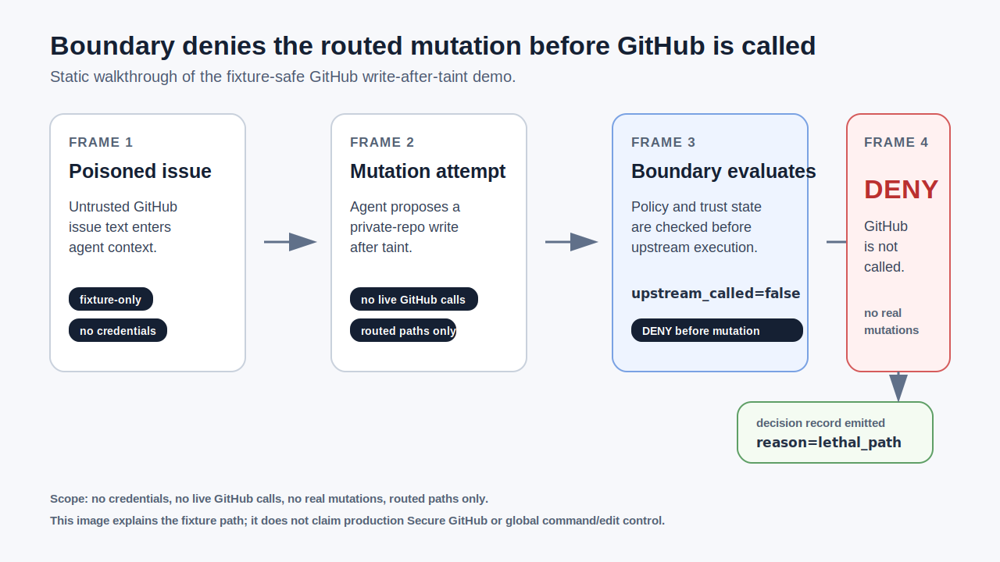
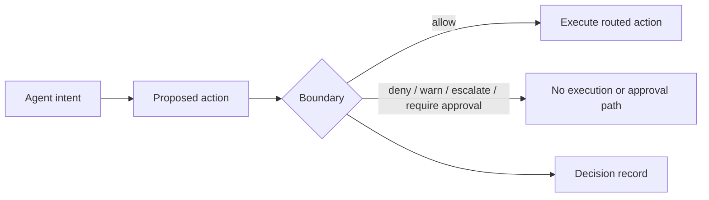

# Fulcrum Boundary

> The action boundary for MCP-native agents.

Your agent is about to touch a real system. Boundary decides before the tool executes, records the verdict, and governs only routes forced through Boundary.

[](https://pkg.go.dev/github.com/fulcrum-governance/fulcrum-boundary)
[](https://github.com/Fulcrum-Governance/Fulcrum-Boundary/actions/workflows/ci.yml)
[](https://goreportcard.com/report/github.com/fulcrum-governance/fulcrum-boundary)
[](./LICENSE)

[Quickstart](#try-it-in-one-minute) | [Demo](./docs/DEMO_GITHUB_LETHAL_TRIFECTA.md) | [Docs](https://fulcrum-governance.github.io/Fulcrum-Boundary/) | [Claims](./docs/CLAIMS_LEDGER.md) | [Release Truth](./docs/RELEASE_TRUTH_PUBLIC.md) | [Security](./SECURITY.md)

## Try It In One Minute

Requires Go 1.25+.

```bash
go install github.com/fulcrum-governance/fulcrum-boundary/cmd/boundary@v0.6.1
boundary selftest
boundary demo github-lethal-trifecta
```

No credentials. No live GitHub calls. No real mutations.

## Walkthrough



Static walkthrough of the fixture-safe GitHub write-after-taint demo. Recording artifacts are retained under `docs/assets/` for reference; the static walkthrough is the primary README demo.

## What It Proves

| Scope | Proof shown by the local fixture |
|---|---|
| Inventory | Boundary can read a fixture MCP client config and list reachable tools. |
| Risk graph | Boundary can connect untrusted GitHub context to a private-repo mutation path. |
| Starter policy | Boundary can generate local starter policies that parse through its verifier. |
| Secure GitHub preview | Boundary can deny the tested write-after-taint fixture before GitHub is touched. |
| Decision record | Boundary records the verdict and reason for the governed route. |

## What It Does Not Prove

| Limit | Why it matters |
|---|---|
| Every malicious prompt | The fixture covers the tested write-after-taint path, not every possible issue or agent behavior. |
| Production Secure GitHub status | Secure GitHub remains preview until deployment bypass evidence and broader live coverage are recorded. |
| Protection for direct tool calls | Boundary governs routed tools. Direct access to the same tool is a bypass unless deployment topology blocks it. |
| Complete production policy | Generated policies are starter policies for operator review. |
| Hosted monitoring | The dashboard reads local artifacts only. |

## Core Model



Boundary governs actions only when the route is forced through Boundary.

## Current Release Truth

| Surface | Status | Limit |
|---|---|---|
| MCP adapter | Production | Governs MCP routes forced through Boundary. |
| Secure GitHub | Preview | Fixture proof and opt-in conformance do not close deployment bypasses. |
| Command Boundary | Delivered preview | Routed command paths only. |
| Edit Boundary | Delivered preview | Routed edit envelopes only. |
| Policy generation | Starter policy utility | Requires operator review. |
| Dashboard | Local artifact visibility | Not hosted monitoring. |

## Adapter Readiness

Adapter maturity is declared in `adapters/<adapter>/readiness.yaml` and summarized in [docs/ADAPTER_READINESS_MATRIX.md](./docs/ADAPTER_READINESS_MATRIX.md).

### Production

- `adapters/mcp`: MCP routes forced through Boundary.

### Preview

- `adapters/a2a`: A2A lifecycle adapter with deployment bypass proof still required.
- `adapters/cli`: CLI wrapper path with sole-execution-path evidence still required.
- `adapters/codeexec`: Code execution adapter with named sandbox and bypass proof still required.
- `adapters/grpc`: gRPC adapter with deployment and streaming evidence still required.
- `adapters/managedagents`: Managed Agents lifecycle surface pending live upstream conformance.
- `adapters/securegithub`: Secure GitHub preview pending deployment bypass proof.
- `adapters/webhook`: Webhook adapter with downstream sole-action-path evidence still required.

## Product Surfaces

| Surface | What it proves today | Limit |
|---|---|---|
| MCP Firewall | Inventory, risk graph, starter policy generation, local dashboard artifacts. | Local visibility does not secure servers by itself. |
| Secure GitHub preview | Denies the fixture write-after-taint path before upstream mutation. | Not a production Secure GitHub claim. |
| Command Boundary preview | Routes selected project command paths through Boundary. | Direct shell paths outside the route are not governed. |
| Edit Boundary preview | Routes selected edit envelopes through Boundary. | Direct file writes outside the route are not governed. |
| Evidence utilities | Bundle and verify local receipts. | Receipts do not prove production safety by themselves. |

## Docs Map

| Need | Start here |
|---|---|
| Install | [docs/INSTALL.md](./docs/INSTALL.md) |
| Demo | [docs/DEMO_GITHUB_LETHAL_TRIFECTA.md](./docs/DEMO_GITHUB_LETHAL_TRIFECTA.md) |
| Claims | [docs/CLAIMS_LEDGER.md](./docs/CLAIMS_LEDGER.md) |
| Release truth | [docs/RELEASE_TRUTH_PUBLIC.md](./docs/RELEASE_TRUTH_PUBLIC.md) |
| Adapter readiness | [docs/ADAPTER_READINESS_MATRIX.md](./docs/ADAPTER_READINESS_MATRIX.md) |
| MCP Firewall | [docs/firewall/DISCOVERY_INVENTORY.md](./docs/firewall/DISCOVERY_INVENTORY.md) |
| Secure GitHub | [docs/secure-mcp/GITHUB.md](./docs/secure-mcp/GITHUB.md) |
| Command Boundary | [docs/command-boundary/README.md](./docs/command-boundary/README.md) |
| Edit Boundary | [docs/edit-boundary/README.md](./docs/edit-boundary/README.md) |
| Security | [SECURITY.md](./SECURITY.md) |

## Development

```bash
make selftest
make demo-github
make release-check
```

## Tests

```bash
go test ./claims/... -count=1
go test ./... -short -count=1 -timeout 5m
make docs-build
```

## Part of the Fulcrum Architecture

Boundary is the downloadable action boundary in the Fulcrum repo family:

| Repo | Role |
|---|---|
| [`Fulcrum-Boundary`](https://github.com/Fulcrum-Governance/Fulcrum-Boundary) | Enforces routed action decisions before privileged tool execution. |
| [`fulcrum-io`](https://github.com/Fulcrum-Governance/fulcrum-io) | Hosted product and operator surfaces. |
| [`fulcrum-trust`](https://github.com/Fulcrum-Governance/fulcrum-trust) | Trust modeling package used by broader Fulcrum work. |
| [`Fulcrum-Proofs`](https://github.com/Fulcrum-Governance/Fulcrum-Proofs) | Lean proof work consumed through documented correspondence and release claims. |

Boundary consumes proof-backed contracts through documented correspondence and decision-mode boundaries; it does not emit `proved` decisions itself. See [docs/PROOF_BOUNDARY.md](./docs/PROOF_BOUNDARY.md).

## License

Apache 2.0 - see [LICENSE](./LICENSE).

## Contributing

See [CONTRIBUTING.md](./CONTRIBUTING.md). For security issues, see [SECURITY.md](./SECURITY.md).
