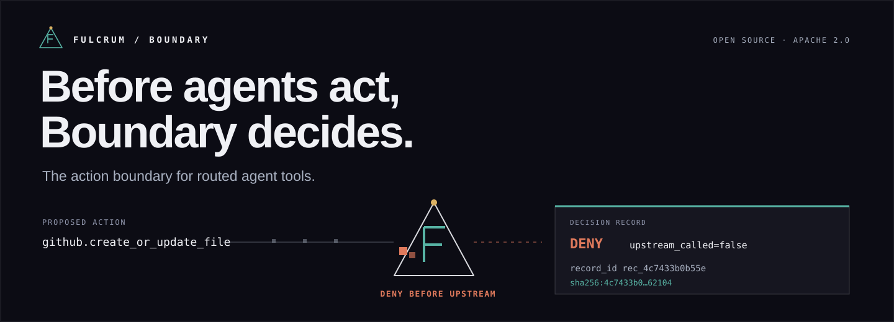
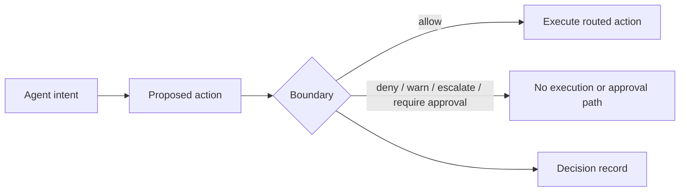
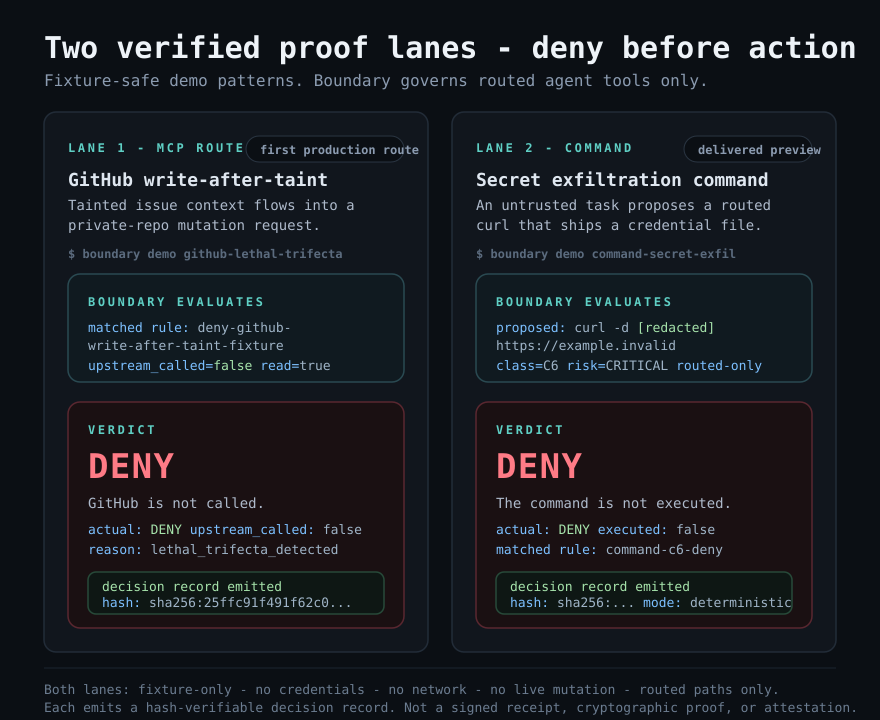

<picture>
  <source media="(prefers-color-scheme: light)" srcset="./docs/assets/readme-hero-light.svg">
  <source media="(prefers-color-scheme: dark)" srcset="./docs/assets/readme-hero-dark.svg">
  
</picture>

<h1 align="center">Fulcrum Boundary</h1>

<p align="center"><strong>Before an AI agent touches a real system, Boundary decides.</strong></p>

<p align="center">
  The open action boundary for routed agent tools. Boundary decides whether a proposed action is allowed before the underlying tool executes, then records the verdict in a hash-verifiable decision record.
</p>

<p align="center">
  <a href="https://pkg.go.dev/github.com/fulcrum-governance/fulcrum-boundary"></a>
  <a href="https://github.com/Fulcrum-Governance/Fulcrum-Boundary/actions/workflows/ci.yml"></a>
  <a href="https://github.com/Fulcrum-Governance/Fulcrum-Boundary/releases/latest"></a>
  <a href="https://goreportcard.com/report/github.com/fulcrum-governance/fulcrum-boundary"></a>
  <a href="./LICENSE"></a>
</p>

<p align="center">
  <a href="#first-run-in-one-minute">Install</a> ·
  <a href="#see-boundary-stop-the-action">Run the demo</a> ·
  <a href="./docs/GOVERN_MCP_SERVER.md">Govern an MCP server</a> ·
  <a href="https://fulcrum-governance.github.io/Fulcrum-Boundary/">Docs</a> ·
  <a href="./SECURITY.md">Security</a>
</p>

Boundary governs only actions whose route is forced through Boundary. Direct
access to the same tool is a bypass unless deployment topology removes that
path. MCP is the first production route; Command Boundary and Edit Boundary are
delivered previews.

## First run in one minute

Install the macOS Homebrew cask, run the self-test, and reproduce a denial:

```bash
brew install fulcrum-governance/tap/boundary
boundary selftest
boundary demo github-lethal-trifecta --out demo.txt
boundary verify-record github-lethal-trifecta-artifacts/decision-record.json
```

The demo is fixture-only: no credentials, network calls, or live mutations. It
denies a routed GitHub write-after-taint action before upstream execution and
writes a decision record that `verify-record` recomputes independently.

On Linux or Windows, use a signed-checksum [release archive](./docs/INSTALL.md)
or the container image:

```bash
docker run --rm ghcr.io/fulcrum-governance/boundary:v0.12.0 selftest
```

To inspect the MCP servers your agents can already reach without modifying
configuration:

```bash
boundary init --dry-run
```

The Homebrew cask, container image, and `_static-nocgo` archives are static
builds. Their Postgres AST classifier is unavailable, so routed SQL classifies
as `UNKNOWN` and the Postgres guard denies it fail-closed. Use a `_cgo` archive
or build from source for the full classifier. See the [install guide](./docs/INSTALL.md)
for platform commands, checksums, SBOMs, and provenance evidence.

## See Boundary stop the action

A coding agent reads untrusted GitHub issue content and proposes a write to a
private repository. On the routed MCP path, Boundary returns `DENY` before the
GitHub mutation call, reports `upstream_called=false`, and emits a decision
record.


| Step | What happens |
|---|---|
| **Proposed action** | `github.create_or_update_file` targets a private repository. |
| **Boundary** | The MCP route evaluates the action before the underlying tool runs. |
| **Verdict** | `DENY`, with `reason=lethal_trifecta_detected`. |
| **Record** | `rec_...` plus a `sha256:` decision hash that `boundary verify-record` recomputes. |

The same shape exists on Command Boundary, a delivered preview: a selected
routed command is evaluated before execution and its verdict is recorded.

## What you get

| Discover | Decide | Record and test |
|---|---|---|
| Inventory MCP client configurations and render reachable risk paths. | Evaluate routed actions against trust, static policy, domain interceptors, and policy rules. | Emit decision records, recompute their hashes, replay decisions, and test policies against local fixtures. |
| Start with `boundary init --dry-run`. | Start with the production MCP route or a labeled preview adapter. | Start with `boundary verify-record`, `boundary replay`, and `boundary test`. |

For a real routed setup, follow [Govern Your MCP Server](./docs/GOVERN_MCP_SERVER.md).
It covers discovery, reversible installation, a live routed denial, `boundary
doctor`, and uninstall. The [host setup guide](./docs/firewall/HOST_SETUP.md)
includes Claude Desktop, Claude Code, Cursor, and VS Code.

## How Boundary works


```mermaid
flowchart LR
  A[Agent intent] --> B[Proposed action]
  B --> C{Boundary}
  C -->|allow| D[Execute routed action]
  C -->|deny / warn / escalate / require approval| E[No execution or approval path]
  C --> F[Decision record]
```

Every routed evaluation follows the same four-stage pipeline: trust check,
static policies, domain interceptors, and the portable policy evaluator. A deny
is terminal. Fault handling is fail-closed on configured protected transports.
See [Architecture](./ARCHITECTURE.md) for the contracts and extension points.

## The record it leaves

Every governed verdict produces a structured [decision record](./docs/DECISION_RECORDS.md).
A receipt-grade record carries request, policy-bundle, and decision hashes, so
an edit after emission is detectable by recomputation:

```bash
boundary verify-record github-lethal-trifecta-artifacts/decision-record.json
# record verification: ok
```

Independent verifiers ship in [Python](./verifiers/python/),
[TypeScript](./verifiers/typescript/), and [Rust](./verifiers/rust/), pinned to
the Go implementation by committed conformance vectors. Optional Ed25519
signing is off by default and adds authorship for operators who manage keys.

A recomputing hash detects changes to covered record fields. It does not prove
that the verdict was correct, that enforcement occurred, or that the signer
managed keys safely. `upstream_called=false` and `executed=false` are adapter
self-reports, not independently corroborated fields of the decision hash. See
[Receipts](./docs/RECEIPTS.md), [Signing](./docs/SIGNING.md), and
[Limitations](./LIMITATIONS.md).

## Two proof lanes

The release has two fixture-only demonstration lanes. Each denies a dangerous
action pattern before it runs and emits a hash-verifiable decision record.



| Lane | Status | Demo | Verified shape |
|---|---|---|---|
| **MCP** | Production for routes forced through Boundary | `boundary demo github-lethal-trifecta` | `actual=DENY`, `upstream_called=false`, `reason=lethal_trifecta_detected` |
| **Command Boundary** | Delivered preview, routed-only | `boundary demo command-secret-exfil` | `actual=DENY`, `executed=false`, `class=C6` |

Both lanes use fixtures only: no credentials, network calls, or live mutations.
They do not establish coverage for every prompt, direct tool path, deployment,
or policy. Secure GitHub remains preview.

## Hard limits

- Boundary governs a route only when deployment forces the action through it.
- Direct shell, editor, filesystem, CI, SSH, or API paths remain outside the
  boundary unless topology removes them.
- Secure GitHub, Command Boundary, Edit Boundary, and the remaining non-MCP
  adapters are labeled previews.
- Generated policies are starter policies for operator review.
- Decision records provide checkable integrity for covered fields, not a proof
  of correct enforcement or production safety.
- Dashboard and evidence utilities are local-only unless an operator supplies
  separate infrastructure.

Read the full [Limitations](./LIMITATIONS.md), [Claims Ledger](./docs/CLAIMS_LEDGER.md),
and [Release Truth](./docs/RELEASE_TRUTH_PUBLIC.md) before relying on a route.
The repository's claims and controlled language are mechanically checked by
`go test ./claims/...` and `make release-check`.

## Current release truth

| Surface | Status | Limit |
|---|---|---|
| MCP adapter | Production | Governs MCP routes forced through Boundary. |
| Secure GitHub | Preview | Fixture proof and opt-in conformance do not close deployment bypasses. |
| Command Boundary | Delivered preview | Routed command paths only. |
| Edit Boundary | Delivered preview | Routed edit envelopes only. |
| Policy-as-code testing | Local-only | `boundary test` checks routed request fixtures against local policy bundles. |
| Policy generation | Starter policy utility | Requires operator review. |
| Dashboard | Local artifact visibility | Not hosted monitoring. |
| Witnessed-log verifier | Delivered, air-gapped | Checks bundle integrity and cosignatures against supplied keys; it does not establish independent witness operation. |

Current published release: **v0.12.0**. See the [release notes](https://github.com/Fulcrum-Governance/Fulcrum-Boundary/releases/tag/v0.12.0),
[changelog](./CHANGELOG.md), and [public release-truth record](./docs/RELEASE_TRUTH_PUBLIC.md).

## Adapter readiness

Adapter maturity is declared in `adapters/<adapter>/readiness.yaml` and checked
against the [Adapter Readiness Matrix](./docs/ADAPTER_READINESS_MATRIX.md).

### Production

- `adapters/mcp`: MCP routes forced through Boundary.

### Preview

- `adapters/a2a`: A2A lifecycle adapter with deployment bypass proof still required.
- `adapters/cli`: CLI wrapper path with sole-execution-path evidence still required.
- `adapters/codeexec`: Code execution adapter with named sandbox and bypass proof still required.
- `adapters/grpc`: gRPC adapter with deployment and streaming evidence still required.
- `adapters/managedagents`: Managed Agents lifecycle surface pending live upstream conformance.
- `adapters/securegithub`: Secure GitHub preview pending deployment bypass proof.
- `adapters/webhook`: Webhook adapter with downstream sole-action-path evidence still required.

## Documentation

| Need | Start here |
|---|---|
| Install and verify a release | [Install](./docs/INSTALL.md) |
| Govern an MCP server | [Govern Your MCP Server](./docs/GOVERN_MCP_SERVER.md) |
| Configure a supported host | [Host Setup](./docs/firewall/HOST_SETUP.md) |
| Understand the model | [Architecture](./ARCHITECTURE.md) and [Boundary Spec](./docs/BOUNDARY_SPEC.md) |
| Compare Boundary with adjacent tools | [Where Boundary Fits](./docs/COMPARISON.md) |
| Read current capability limits | [Release Truth](./docs/RELEASE_TRUTH_PUBLIC.md) and [Limitations](./LIMITATIONS.md) |
| Verify decision records | [Decision Records](./docs/DECISION_RECORDS.md), [Receipts](./docs/RECEIPTS.md), and [Signing](./docs/SIGNING.md) |
| Test policies | [Policy Testing](./docs/POLICY_TESTING.md) |
| Check route deployment | [Route Conformance](./docs/ROUTE_CONFORMANCE_CHECKLIST.md) |
| Review public claims | [Claims Ledger](./docs/CLAIMS_LEDGER.md) and [How We Keep Ourselves Honest](./docs/HOW_WE_KEEP_OURSELVES_HONEST.md) |
| Troubleshoot first run | [Troubleshooting](./docs/TROUBLESHOOTING.md) |
| Browse all guides | [Documentation site](https://fulcrum-governance.github.io/Fulcrum-Boundary/) |

## Development

Requires Go 1.25+. The default source build links the full Postgres classifier
through cgo and requires a C toolchain:

```bash
go install github.com/fulcrum-governance/fulcrum-boundary/cmd/boundary@v0.12.0
```

Before submitting a change:

```bash
make release-check
go test ./claims/... -count=1
go test ./... -count=1 -timeout 5m
make docs-build
```

See [Contributing](./CONTRIBUTING.md), [Testing](./docs/TESTING.md), and the
[Code of Conduct](./CODE_OF_CONDUCT.md). Questions belong in
[GitHub Discussions](https://github.com/Fulcrum-Governance/Fulcrum-Boundary/discussions);
security reports follow [SECURITY.md](./SECURITY.md).

## Part of the Fulcrum architecture

Boundary is the open action boundary in the Fulcrum repo family. The hosted
operator surfaces remain private during build; `fulcrum-trust` supplies public
trust-modeling work, and [Fulcrum-Proofs](https://github.com/Fulcrum-Governance/Fulcrum-Proofs)
holds the Lean proof work used through documented correspondence.

Boundary's runtime behavior corresponds by design to a machine-checked equilibrium analysis
upstream in Fulcrum-Proofs. That analysis is a design
constraint, not a runtime certificate. Boundary itself does not emit `proved`
decisions. See [Proof Boundary](./docs/PROOF_BOUNDARY.md).

## Project

- [Apache 2.0 License](./LICENSE)
- [Security Policy](./SECURITY.md)
- [Support](./SUPPORT.md)
- [Maintainers](./MAINTAINERS.md)
- [Contributing](./CONTRIBUTING.md)
- [Code of Conduct](./CODE_OF_CONDUCT.md)
- [Changelog](./CHANGELOG.md)
- [Citation](./CITATION.cff)
