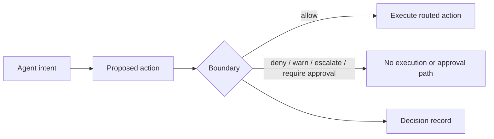
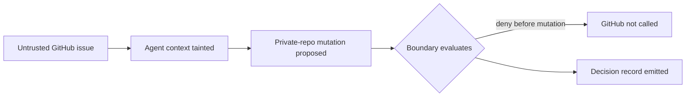
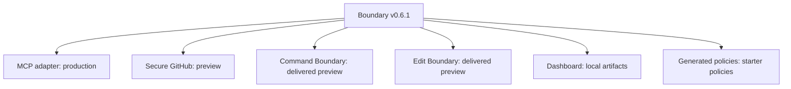

# Boundary Public Surface Reset Implementation Plan

> **For agentic workers:** REQUIRED SUB-SKILL: Use superpowers:subagent-driven-development (recommended) or superpowers:executing-plans to implement this plan task-by-task. Steps use checkbox (`- [ ]`) syntax for tracking.

**Goal:** Make Boundary's public repo and docs-site present v0.6.1 as a polished, claim-safe action-boundary release without adding product behavior.

**Architecture:** This is a docs-and-asset stabilization lane. It edits public text, demo assets, README hierarchy, diagram source files, docs-site pages, and release-truth presentation notes in dependency order while preserving the current runtime and existing verification gates.

**Tech Stack:** Markdown, SVG, Mermaid, MkDocs Material, Bash release gates, Go claim and regression tests.

---

## Scope And Authority

Use the approved design at `conductor/2026-05-29-boundary-public-surface-reset-design.md` as the local lane design. Use current release truth and claim files as authority when wording capability limits:

- `docs/RELEASE_TRUTH_PUBLIC.md`
- `docs/RELEASE_TRUTH_REPO_POLISH.md`
- `docs/REPO_PRESENTATION.md`
- `docs/CLAIMS_LEDGER.md`
- `claims/boundary_claims.yaml`
- `docs/COPY_RULES.md`
- `docs/LANGUAGE_SYSTEM.md`
- `docs/LEXICON.md`

Do not add runtime features. Do not promote preview surfaces. Do not add live credentials, registry publishing, or production support claims.

## Expert Execution Strategy

Use subagent-driven execution unless the user explicitly selects inline execution:

- Public hygiene agent: `SECURITY.md`, `CONTRIBUTING.md`, `CODE_OF_CONDUCT.md`, `CHANGELOG.md`.
- Demo visual agent: walkthrough SVG and asset path updates.
- README and diagrams agent: README hierarchy and Mermaid source files.
- Docs-site agent: docs-site homepage, demo, quickstart, and nav/link audit.
- Verification reviewer: scan results, docs build, Go gates, release check, and final risk report.

Each agent should work on one task, return a diff summary and command results, then stop for review before the next task starts.

## File Map

Create:

- `docs/assets/boundary-demo-walkthrough.svg`: canonical static walkthrough for README.
- `docs-site/assets/boundary-demo-walkthrough.svg`: docs-site copy of the same walkthrough asset.
- `docs/diagrams/action-boundary.mmd`: source Mermaid for the core action-boundary flow.
- `docs/diagrams/github-write-after-taint.mmd`: source Mermaid for the fixture write-after-taint path.
- `docs/diagrams/surface-status.mmd`: source Mermaid for release surface maturity.

Modify:

- `SECURITY.md`: Boundary naming, approved contact, claim-safe limitations, no invented response promise.
- `CONTRIBUTING.md`: Boundary naming, current local gates, approved contact, current CI wording.
- `CODE_OF_CONDUCT.md`: approved contact only.
- `CHANGELOG.md`: product-facing fixture-safe demo wording.
- `README.md`: compact public landing page hierarchy, walkthrough as primary visual, small Mermaid diagram, no large ASCII architecture block.
- `docs-site/index.md`: docs homepage with quickstart, walkthrough, release truth, and links.
- `docs-site/demo.md`: walkthrough primary, terminal recording only as receipt evidence.
- `docs-site/quickstart.md`: expected output summary plus fixture-only and routed-only caveats.
- `docs/REPO_PRESENTATION.md`: public presentation status reflects walkthrough primary and terminal receipt.
- `docs/RELEASE_TRUTH_REPO_POLISH.md`: repo polish checklist reflects walkthrough primary and terminal receipt.
- `docs/RELEASE_TRUTH_PUBLIC.md`: only update wording if README/docs-site presentation facts changed.

Do not modify code packages unless a docs validation test requires a narrow fixture update.

---

### Task 0: Baseline And Branch Guard

**Files:**
- Read: repo status and authority files only.

- [ ] **Step 1: Confirm branch and cleanliness**

Run:

```bash
git status --short --branch
```

Expected: branch is `codex/2026-05-29-public-surface-reset` and no dirty file lines are printed.

- [ ] **Step 2: Confirm no active session handoff file exists**

Run:

```bash
find . -maxdepth 3 -type f \( -name 'CODEX_SESSION_LOG.md' -o -name '*HANDOFF*.md' -o -name '*handoff*.md' \) -print
```

Expected: no `CODEX_SESSION_LOG.md`; any other handoff file printed must be read before edits.

- [ ] **Step 3: Capture current public-surface hits without editing**

Run:

```bash
bad_contacts='(security|hello|help|support)@fulcrumlayer[.]io'
legacy_name="$(printf 'G%sL' I)"
private_pattern='Y''C|Y ''Combinator|Codex ''execution|goal ''usage|/Users''/|Next''_Spec|docs/''superpowers|[.]claude/sprint'
grep -RInE "$bad_contacts|@fulcrumlayer[.]io" README.md SECURITY.md CONTRIBUTING.md CODE_OF_CONDUCT.md CHANGELOG.md docs docs-site .github actions mkdocs.yml || true
grep -RInE "$private_pattern" README.md SECURITY.md CONTRIBUTING.md CODE_OF_CONDUCT.md CHANGELOG.md docs docs-site .github actions mkdocs.yml || true
grep -RIn "$legacy_name" README.md SECURITY.md CONTRIBUTING.md CODE_OF_CONDUCT.md docs docs-site || true
```

Expected: current hits identify files for Task 1 and Task 3. No files are changed by this step.

---

### Task 1: Public Hygiene Documents

**Files:**
- Modify: `SECURITY.md`
- Modify: `CONTRIBUTING.md`
- Modify: `CODE_OF_CONDUCT.md`
- Modify: `CHANGELOG.md`

- [ ] **Step 1: Replace `SECURITY.md` with Boundary-specific security policy**

Set `SECURITY.md` to:

```markdown
# Fulcrum Boundary Security Policy

## Reporting a vulnerability

Email: **agent@fulcrumlayer.io**

Please include:

- A description of the issue and the version or commit affected.
- A minimal reproducer when one is available.
- Your assessment of impact and any known exploitation conditions.
- Whether the issue has been disclosed elsewhere.

Do not file public GitHub issues for security vulnerabilities.

We review security reports as project maintainers have availability and
prioritize issues that affect released Boundary behavior. This repository does
not advertise a bounty, guaranteed response window, or hosted incident
response service.

## What is in scope

Boundary is the action boundary for routed agent tool calls. The following are
in scope for this repository:

- Bypasses where a routed tool call reaches a downstream tool without passing
  through Boundary evaluation.
- Incorrect fail-closed or fail-open behavior, including evaluator errors that
  lead to an unsafe allow decision on a fail-closed path.
- Race conditions in the evaluation pipeline or adapter paths.
- Logic bugs in static policy, policy evaluation, or interceptor stages that
  invert intended semantics.
- Parser vulnerabilities across released adapters and preview adapter packages.
- Fixture or evidence utilities that report a deny decision while still making
  the upstream mutation call.

## Known limitations

Boundary evaluates routed action metadata, arguments, policy state, and adapter
context. It does not perform general semantic analysis of every natural-language
prompt, every tool output, or every bypass path outside the routed deployment
topology.

Known limits include:

- Direct tool access is outside Boundary unless deployment topology removes or
  blocks that bypass.
- Secure GitHub is a preview surface; fixture and conformance receipts do not
  make it a production GitHub security product.
- Command Boundary is a preview, routed-path-only surface; it does not control
  every shell command on a machine.
- Edit Boundary is a preview, routed-edit-envelope-only surface; it does not
  control every file write on a machine.
- Generated policies are starter policies for operator review, not complete
  production policy.
- Dashboard output is local-only artifact visibility, not hosted monitoring.
- Some encoded, compiled, or transformed payloads can evade static parser
  coverage unless a routed adapter or interceptor recognizes them.

## Dependencies

Boundary keeps the root module dependency set small and runs vulnerability
checks through repository CI. Dependency scan results are one signal; they do
not by themselves prove production safety for a deployment.

## Disclosure credit

Unless you ask otherwise, valid reports may be credited in release notes for
the fix.
```

- [ ] **Step 2: Replace `CONTRIBUTING.md` with current Boundary contribution guidance**

Set `CONTRIBUTING.md` to:

```markdown
# Contributing to Fulcrum Boundary

Thank you for considering a contribution. Boundary is the action boundary for
routed AI-agent tool paths, and scope discipline matters: changes should make
that boundary clearer, safer, or easier to verify.

Project docs: [Security](./SECURITY.md) | [Code of Conduct](./CODE_OF_CONDUCT.md) | [Changelog](./CHANGELOG.md) | [Citation](./CITATION.cff)

## Maintainer Expectations

Security issues get priority. Response times on other issues may vary. If a
pull request sits idle for more than a few weeks, a polite bump is fine.

## Filing Issues

Use the templates when they fit. They collect the information needed to
diagnose a report.

- Bug reports: Go version, OS, steps to reproduce, expected result, actual
  result, and a minimal reproducer when possible.
- Feature requests: the use case, the proposed behavior, and alternatives
  considered.
- Questions: open an issue and use the `question` label when available.

## Submitting Pull Requests

1. Fork the repository.
2. Create a branch from `main` named for the change.
3. Keep commits focused and scoped to one lane.
4. Run the local checks below before requesting review.
5. Open a pull request against `main` and describe what changed, why it changed,
   and what verification you ran.

For larger changes, including new adapters, new extension points, release
claim changes, or public positioning changes, open an issue first to discuss
the shape before writing code.

## Local Checks

Run these gates for public-surface or release-truth work:

```bash
make release-check
go test ./claims/... -count=1
go test ./... -short -count=1 -timeout 5m
make docs-build
```

Run formatting and static checks for Go changes:

```bash
git ls-files '*.go' | xargs gofmt -l
go vet ./...
```

Expected results:

- `gofmt -l` prints no file paths.
- `go vet ./...` exits cleanly.
- Claim tests and short Go tests pass.
- Docs build succeeds in strict mode.
- `make release-check` completes without public-surface or release gate
  failures.

## Code Style

- Use `gofmt` for Go.
- Prefer small, focused functions.
- Keep tests next to the code they test when that matches the existing package
  pattern.
- Public identifiers need doc comments that state the contract callers can rely
  on.
- Preserve routed-only and fixture-only caveats in public language.

## Scope

Boundary work belongs here when it changes:

- Evaluation pipeline stages and their contracts.
- Transport adapter packages and routed preview surfaces.
- Portable policy evaluation primitives.
- Evidence, selftest, release, and local diagnostic utilities.
- Public docs that describe Boundary's released behavior.

The following do not belong in this repository as direct product claims:

- Hosted monitoring or team control-plane promises.
- Complete production policy generation.
- Global control over commands or file writes outside routed Boundary paths.
- Universal protection for tools that bypass Boundary.
- Runtime proof claims beyond the documented proof boundary and empirical
  validation receipts.

## Security Issues

Do not open a public issue for security vulnerabilities. Follow the process in
[SECURITY.md](./SECURITY.md) and email `agent@fulcrumlayer.io`.

## Licensing

By submitting a pull request, you agree that your contribution is licensed
under the Apache License 2.0, the same license as the repository. No CLA is
required.
```

- [ ] **Step 3: Update `CODE_OF_CONDUCT.md` contact**

Run:

```bash
perl -0pi -e 's/[A-Za-z0-9._%+-]+\@fulcrumlayer[.]io/agent\@fulcrumlayer.io/g' CODE_OF_CONDUCT.md
```

Expected: every Fulcrum contact in `CODE_OF_CONDUCT.md` is `agent@fulcrumlayer.io`.

- [ ] **Step 4: Update `CHANGELOG.md` internal-demo release note**

Replace the internal-demo wording in the v0.6.1 section with this bullet:

```markdown
- Added fixture-safe demo/docs for the GitHub write-after-taint path.
```

Expected: release notes no longer mention private planning packets or capture scripts.

- [ ] **Step 5: Verify hygiene documents**

Run:

```bash
bad_contacts='(security|hello|help|support)@fulcrumlayer[.]io'
legacy_name="$(printf 'G%sL' I)"
grep -RInE "$bad_contacts" SECURITY.md CONTRIBUTING.md CODE_OF_CONDUCT.md CHANGELOG.md || true
grep -RIn "@fulcrumlayer[.]io" SECURITY.md CONTRIBUTING.md CODE_OF_CONDUCT.md CHANGELOG.md || true
grep -RIn "$legacy_name" SECURITY.md CONTRIBUTING.md CODE_OF_CONDUCT.md || true
```

Expected:

- First command prints no matches.
- Second command prints only `agent@fulcrumlayer.io` occurrences.
- Third command prints no current-product naming matches in the edited files.

- [ ] **Step 6: Commit hygiene documents**

Run:

```bash
git add SECURITY.md CONTRIBUTING.md CODE_OF_CONDUCT.md CHANGELOG.md
git commit -m "docs: sanitize public repo hygiene"
```

Expected: commit succeeds.

---

### Task 2: Static Walkthrough Asset

**Files:**
- Create: `docs/assets/boundary-demo-walkthrough.svg`
- Create: `docs-site/assets/boundary-demo-walkthrough.svg`

- [ ] **Step 1: Create canonical README walkthrough SVG**

Create `docs/assets/boundary-demo-walkthrough.svg` with:

```svg
<svg xmlns="http://www.w3.org/2000/svg" width="1280" height="720" viewBox="0 0 1280 720" role="img" aria-labelledby="title desc">
  <title id="title">Boundary fixture-safe GitHub write-after-taint walkthrough</title>
  <desc id="desc">Four-frame static walkthrough showing a poisoned GitHub issue entering agent context, a private repository mutation attempt, Boundary evaluation before execution, and a deny verdict with a decision record.</desc>
  <defs>
    <style>
      .bg { fill: #f7f8fb; }
      .panel { fill: #ffffff; stroke: #c9d1dc; stroke-width: 2; rx: 18; }
      .panel-accent { fill: #eef4ff; stroke: #7aa2e3; stroke-width: 2; rx: 18; }
      .deny { fill: #fff1f1; stroke: #d55b5b; stroke-width: 2; rx: 18; }
      .record { fill: #f4fbf2; stroke: #5f9f66; stroke-width: 2; rx: 18; }
      .title { font: 700 34px Arial, Helvetica, sans-serif; fill: #152033; }
      .subtitle { font: 400 20px Arial, Helvetica, sans-serif; fill: #4b5870; }
      .step { font: 700 17px Arial, Helvetica, sans-serif; fill: #536174; letter-spacing: .08em; }
      .head { font: 700 25px Arial, Helvetica, sans-serif; fill: #152033; }
      .body { font: 400 18px Arial, Helvetica, sans-serif; fill: #344055; }
      .small { font: 700 15px Arial, Helvetica, sans-serif; fill: #536174; }
      .chip { fill: #152033; rx: 13; }
      .chipText { font: 700 14px Arial, Helvetica, sans-serif; fill: #ffffff; }
      .arrow { stroke: #607089; stroke-width: 3; fill: none; marker-end: url(#arrowhead); }
      .denyText { font: 800 34px Arial, Helvetica, sans-serif; fill: #ba3030; }
      .mono { font: 700 17px Menlo, Consolas, monospace; fill: #243044; }
    </style>
    <marker id="arrowhead" markerWidth="12" markerHeight="8" refX="10" refY="4" orient="auto">
      <path d="M0,0 L12,4 L0,8 Z" fill="#607089" />
    </marker>
  </defs>

  <rect class="bg" width="1280" height="720" />
  <text class="title" x="64" y="70">Boundary denies the routed mutation before GitHub is called</text>
  <text class="subtitle" x="64" y="105">Static walkthrough of the fixture-safe GitHub write-after-taint demo.</text>

  <g transform="translate(64 146)">
    <rect class="panel" width="250" height="330" />
    <text class="step" x="24" y="42">FRAME 1</text>
    <text class="head" x="24" y="82">Poisoned issue</text>
    <text class="body" x="24" y="125">Untrusted GitHub</text>
    <text class="body" x="24" y="151">issue text enters</text>
    <text class="body" x="24" y="177">agent context.</text>
    <rect class="chip" x="24" y="222" width="108" height="30" />
    <text class="chipText" x="38" y="243">fixture-only</text>
    <rect class="chip" x="24" y="262" width="126" height="30" />
    <text class="chipText" x="38" y="283">no credentials</text>
  </g>

  <path class="arrow" d="M338 310 H400" />

  <g transform="translate(424 146)">
    <rect class="panel" width="250" height="330" />
    <text class="step" x="24" y="42">FRAME 2</text>
    <text class="head" x="24" y="82">Mutation attempt</text>
    <text class="body" x="24" y="125">Agent proposes a</text>
    <text class="body" x="24" y="151">private-repo write</text>
    <text class="body" x="24" y="177">after taint.</text>
    <rect class="chip" x="24" y="222" width="164" height="30" />
    <text class="chipText" x="38" y="243">no live GitHub calls</text>
    <rect class="chip" x="24" y="262" width="136" height="30" />
    <text class="chipText" x="38" y="283">routed paths only</text>
  </g>

  <path class="arrow" d="M698 310 H760" />

  <g transform="translate(784 146)">
    <rect class="panel-accent" width="250" height="330" />
    <text class="step" x="24" y="42">FRAME 3</text>
    <text class="head" x="24" y="82">Boundary evaluates</text>
    <text class="body" x="24" y="125">Policy and trust state</text>
    <text class="body" x="24" y="151">are checked before</text>
    <text class="body" x="24" y="177">upstream execution.</text>
    <text class="mono" x="24" y="236">upstream_called=false</text>
    <rect class="chip" x="24" y="262" width="220" height="30" />
    <text class="chipText" x="38" y="283">DENY before mutation</text>
  </g>

  <path class="arrow" d="M1058 310 H1120" />

  <g transform="translate(944 515)">
    <rect class="record" width="250" height="78" />
    <text class="small" x="24" y="32">decision record emitted</text>
    <text class="mono" x="24" y="58">reason=lethal_path</text>
  </g>

  <g transform="translate(1084 146)">
    <rect class="deny" width="132" height="330" />
    <text class="step" x="22" y="42">FRAME 4</text>
    <text class="denyText" x="22" y="108">DENY</text>
    <text class="body" x="22" y="150">GitHub</text>
    <text class="body" x="22" y="176">is not</text>
    <text class="body" x="22" y="202">called.</text>
    <text class="small" x="22" y="260">no real</text>
    <text class="small" x="22" y="282">mutations</text>
  </g>

  <path class="arrow" d="M1150 476 V510" />

  <text class="small" x="64" y="644">Scope: no credentials, no live GitHub calls, no real mutations, routed paths only.</text>
  <text class="small" x="64" y="672">This image explains the fixture path; it does not claim production Secure GitHub or global command/edit control.</text>
</svg>
```

- [ ] **Step 2: Copy the same asset into docs-site**

Run:

```bash
cp docs/assets/boundary-demo-walkthrough.svg docs-site/assets/boundary-demo-walkthrough.svg
```

Expected: `cmp docs/assets/boundary-demo-walkthrough.svg docs-site/assets/boundary-demo-walkthrough.svg` exits cleanly.

- [ ] **Step 3: Verify the SVG has only claim-safe labels**

Run:

```bash
rg -n "fixture-only|no credentials|no live GitHub calls|no real mutations|DENY before mutation|decision record emitted|routed paths only" docs/assets/boundary-demo-walkthrough.svg
```

Expected: each required label appears at least once.

- [ ] **Step 4: Commit walkthrough assets**

Run:

```bash
git add docs/assets/boundary-demo-walkthrough.svg docs-site/assets/boundary-demo-walkthrough.svg
git commit -m "docs: add static Boundary demo walkthrough"
```

Expected: commit succeeds.

---

### Task 3: README Hierarchy And Primary Visual

**Files:**
- Modify: `README.md`

- [ ] **Step 1: Replace README opening through docs map with compact landing content**

Replace the content from the title through the docs map with this structure. Keep the deeper operational sections after the docs map only when they add details not already covered by linked docs.

```markdown
# Fulcrum Boundary

> The action boundary for MCP-native agents.

Your agent is about to touch a real system. Boundary decides before the tool executes, records the verdict, and governs only routes forced through Boundary.

[](https://pkg.go.dev/github.com/fulcrum-governance/fulcrum-boundary)
[](https://github.com/Fulcrum-Governance/Fulcrum-Boundary/actions/workflows/ci.yml)
[](https://goreportcard.com/report/github.com/fulcrum-governance/fulcrum-boundary)
[](./LICENSE)

[Quickstart](#try-it-in-one-minute) | [Demo](./docs/DEMO_GITHUB_LETHAL_TRIFECTA.md) | [Docs](https://fulcrum-governance.github.io/Fulcrum-Boundary/) | [Claims](./docs/CLAIMS_LEDGER.md) | [Release Truth](./docs/RELEASE_TRUTH_PUBLIC.md) | [Security](./SECURITY.md)

## Try It In One Minute

Requires Go 1.25+.

```bash
go install github.com/fulcrum-governance/fulcrum-boundary/cmd/boundary@v0.6.1
boundary selftest
boundary demo github-lethal-trifecta
```

No credentials. No live GitHub calls. No real mutations.

## Walkthrough


Static walkthrough of the fixture-safe GitHub write-after-taint demo. The terminal recording is retained as a receipt, not as the primary demo.

## What It Proves

| Scope | Proof shown by the local fixture |
|---|---|
| Inventory | Boundary can read a fixture MCP client config and list reachable tools. |
| Risk graph | Boundary can connect untrusted GitHub context to a private-repo mutation path. |
| Starter policy | Boundary can generate local starter policies that parse through its verifier. |
| Secure GitHub preview | Boundary can deny the tested write-after-taint fixture before GitHub is touched. |
| Decision record | Boundary records the verdict and reason for the governed route. |

## What It Does Not Prove

| Limit | Why it matters |
|---|---|
| Every malicious prompt | The fixture covers the tested write-after-taint path, not every possible issue or agent behavior. |
| Production Secure GitHub status | Secure GitHub remains preview until deployment bypass evidence and broader live coverage are recorded. |
| Protection for direct tool calls | Boundary governs routed tools. Direct access to the same tool is a bypass unless deployment topology blocks it. |
| Complete production policy | Generated policies are starter policies for operator review. |
| Hosted monitoring | The dashboard reads local artifacts only. |

## Core Model



Boundary governs actions only when the route is forced through Boundary.

## Current Release Truth

| Surface | Status | Limit |
|---|---|---|
| MCP adapter | Production | Governs MCP routes forced through Boundary. |
| Secure GitHub | Preview | Fixture proof and opt-in conformance do not close deployment bypasses. |
| Command Boundary | Delivered preview | Routed command paths only. |
| Edit Boundary | Delivered preview | Routed edit envelopes only. |
| Policy generation | Starter policy utility | Requires operator review. |
| Dashboard | Local artifact visibility | Not hosted monitoring. |

## Product Surfaces

| Surface | What it proves today | Limit |
|---|---|---|
| MCP Firewall | Inventory, risk graph, starter policy generation, local dashboard artifacts. | Local visibility does not secure servers by itself. |
| Secure GitHub preview | Denies the fixture write-after-taint path before upstream mutation. | Not a production Secure GitHub claim. |
| Command Boundary preview | Routes selected project command paths through Boundary. | Direct shell paths outside the route are not governed. |
| Edit Boundary preview | Routes selected edit envelopes through Boundary. | Direct file writes outside the route are not governed. |
| Evidence utilities | Bundle and verify local receipts. | Receipts do not prove production safety by themselves. |

## Docs Map

| Need | Start here |
|---|---|
| Install | [docs/INSTALL.md](./docs/INSTALL.md) |
| Demo | [docs/DEMO_GITHUB_LETHAL_TRIFECTA.md](./docs/DEMO_GITHUB_LETHAL_TRIFECTA.md) |
| Claims | [docs/CLAIMS_LEDGER.md](./docs/CLAIMS_LEDGER.md) |
| Release truth | [docs/RELEASE_TRUTH_PUBLIC.md](./docs/RELEASE_TRUTH_PUBLIC.md) |
| Adapter readiness | [docs/ADAPTER_READINESS_MATRIX.md](./docs/ADAPTER_READINESS_MATRIX.md) |
| MCP Firewall | [docs/MCP_FIREWALL.md](./docs/MCP_FIREWALL.md) |
| Secure GitHub | [docs/SECURE_MCP_GITHUB.md](./docs/SECURE_MCP_GITHUB.md) |
| Command Boundary | [docs/COMMAND_BOUNDARY.md](./docs/COMMAND_BOUNDARY.md) |
| Edit Boundary | [docs/EDIT_BOUNDARY.md](./docs/EDIT_BOUNDARY.md) |
| Security | [SECURITY.md](./SECURITY.md) |
```

- [ ] **Step 2: Remove the large ASCII architecture block**

Delete the section headed `## Architecture` if it contains a multi-line text diagram. Keep any useful prose by moving it into a concise `## Part of the Fulcrum Architecture` section near the bottom:

```markdown
## Part of the Fulcrum Architecture

Boundary is the downloadable action boundary in the Fulcrum repo family:

| Repo | Role |
|---|---|
| `Fulcrum-Boundary` | Enforces routed action decisions before privileged tool execution. |
| `fulcrum-io` | Hosted product and operator surfaces. |
| `fulcrum-trust` | Trust modeling package used by broader Fulcrum work. |
| `Fulcrum-Proofs` | Lean proof work consumed through documented correspondence and release claims. |
```

- [ ] **Step 3: Push bulky implementation examples below the public landing sections**

Keep these headings only after `## Docs Map`, or delete duplicated prose when the linked docs already cover it:

- `## Release Utility Commands`
- `## MCP Firewall Local Visibility`
- `## Secure GitHub Preview`
- `## Command Boundary Preview`
- `## Filesystem/Edit Boundary Preview`
- `## GitHub Action`
- `## MCP Safety Gateway / Postgres Demo`
- `## Library Quick Start`
- `## HTTP Middleware`

Expected: the first screen now explains Boundary, one-minute proof, and limits before deep implementation detail.

- [ ] **Step 4: Verify README public hierarchy**

Run:

```bash
rg -n "boundary-action-demo[.]gif|```text|┌|├|└|│|ASCII" README.md || true
rg -n "Boundary demo walkthrough|docs/assets/boundary-demo-walkthrough.svg|Boundary governs actions only when the route is forced through Boundary" README.md
```

Expected:

- First command prints no matches for the old primary demo asset or text-diagram characters.
- Second command prints the new walkthrough image and routed-only caveat.

- [ ] **Step 5: Commit README hierarchy**

Run:

```bash
git add README.md
git commit -m "docs: polish README public hierarchy"
```

Expected: commit succeeds.

---

### Task 4: Mermaid Diagram Sources

**Files:**
- Create: `docs/diagrams/action-boundary.mmd`
- Create: `docs/diagrams/github-write-after-taint.mmd`
- Create: `docs/diagrams/surface-status.mmd`

- [ ] **Step 1: Create `docs/diagrams` directory**

Run:

```bash
mkdir -p docs/diagrams
```

Expected: directory exists.

- [ ] **Step 2: Create `docs/diagrams/action-boundary.mmd`**

Write:


- [ ] **Step 3: Create `docs/diagrams/github-write-after-taint.mmd`**

Write:



- [ ] **Step 4: Create `docs/diagrams/surface-status.mmd`**

Write:



- [ ] **Step 5: Verify diagram constraints**

Run:

```bash
for f in docs/diagrams/action-boundary.mmd docs/diagrams/github-write-after-taint.mmd docs/diagrams/surface-status.mmd; do printf '%s ' "$f"; rg -o "\\[[^]]+\\]|\\{[^}]+\\}" "$f" | wc -l; done
```

Expected: each printed node count is small and readable; README diagram has no more than six nodes.

- [ ] **Step 6: Commit diagram sources**

Run:

```bash
git add docs/diagrams/action-boundary.mmd docs/diagrams/github-write-after-taint.mmd docs/diagrams/surface-status.mmd
git commit -m "docs: add Boundary diagram sources"
```

Expected: commit succeeds.

---

### Task 5: Docs-Site Polish

**Files:**
- Modify: `docs-site/index.md`
- Modify: `docs-site/demo.md`
- Modify: `docs-site/quickstart.md`
- Read: `mkdocs.yml`

- [ ] **Step 1: Replace docs-site homepage**

Set `docs-site/index.md` to:

```markdown
# Fulcrum Boundary

The action boundary for MCP-native agents.

Your agent is about to touch a real system. Boundary decides before the tool
executes, records the verdict, and governs only routes forced through Boundary.

## Try It In One Minute

```bash
go install github.com/fulcrum-governance/fulcrum-boundary/cmd/boundary@v0.6.1
boundary selftest
boundary demo github-lethal-trifecta
```

No credentials. No live GitHub calls. No real mutations.


Static walkthrough of the fixture-safe GitHub write-after-taint demo.

## Current Release Truth

| Surface | Status | Limit |
|---|---|---|
| MCP adapter | Production | Governs MCP routes forced through Boundary. |
| Secure GitHub | Preview | Fixture proof and opt-in conformance do not close deployment bypasses. |
| Command Boundary | Delivered preview | Routed command paths only. |
| Edit Boundary | Delivered preview | Routed edit envelopes only. |
| Policy generation | Starter policy utility | Requires operator review. |
| Dashboard | Local artifact visibility | Not hosted monitoring. |

## Start Here

| Need | Page |
|---|---|
| Run the local path | [Quickstart](quickstart.md) |
| Understand the flagship fixture | [Demo](demo.md) |
| Learn the action-boundary model | [Concepts](concepts/action-boundary.md) |
| Check public claim status | [Claims](reference/claims.md) |
| Verify release utilities | [Release Utilities](reference/release-utilities.md) |
```

- [ ] **Step 2: Replace docs-site demo page**

Set `docs-site/demo.md` to:

```markdown
# Demo

The flagship local demo is the GitHub write-after-taint fixture.

## Exact Command

```bash
boundary demo github-lethal-trifecta
```

Expected success signal:

```text
actual action: DENY
reason: lethal_trifecta_detected
upstream_called=false
```


Static walkthrough of the fixture-safe GitHub write-after-taint demo.

## What It Proves

- Boundary can inventory a fixture GitHub MCP server.
- Boundary can render an untrusted GitHub issue to private-repo mutation risk
  path.
- Boundary can generate starter policies that parse through its verifier.
- Secure GitHub preview can deny the tested write-after-taint fixture before
  upstream GitHub mutation.
- Boundary emits a decision record for the governed route.

## What It Does Not Prove

- It does not prove protection against every malicious prompt.
- It does not make Secure GitHub a production surface.
- It does not call live GitHub or mutate a real repository.
- It does not protect tools that bypass Boundary.
- It does not prove production route enforcement.

## Terminal Receipt


The terminal receipt shows the local fixture command completing. It is not a
live GitHub run and does not prove production route enforcement.

## Source Doc

Read the canonical source demo doc:
[docs/DEMO_GITHUB_LETHAL_TRIFECTA.md](https://github.com/Fulcrum-Governance/Fulcrum-Boundary/blob/main/docs/DEMO_GITHUB_LETHAL_TRIFECTA.md).
```

- [ ] **Step 3: Replace docs-site quickstart page**

Set `docs-site/quickstart.md` to:

```markdown
# Quickstart

Install the CLI and run the local smoke path.

## Install

Requires Go 1.25+.

```bash
go install github.com/fulcrum-governance/fulcrum-boundary/cmd/boundary@v0.6.1
boundary selftest
boundary demo github-lethal-trifecta
```

Expected demo success signal:

```text
actual action: DENY
reason: lethal_trifecta_detected
upstream_called=false
```

No credentials are required. The selftest and demo use fixture data and do not
perform live GitHub calls or real system mutation.

Boundary governs actions only when the route is forced through Boundary.

## From Source

```bash
git clone https://github.com/Fulcrum-Governance/Fulcrum-Boundary.git
cd Fulcrum-Boundary
go run ./cmd/boundary selftest
go run ./cmd/boundary demo github-lethal-trifecta
```

## Useful Local Gates

```bash
make selftest
make demo-github
make release-check
```
```

- [ ] **Step 4: Confirm docs-site nav already covers required pages**

Run:

```bash
rg -n "Home: index.md|Quickstart: quickstart.md|Demo: demo.md|Concepts:|Claims: reference/claims.md|Release Utilities: reference/release-utilities.md" mkdocs.yml
```

Expected: all required docs-site nav entries are present. Do not modify `mkdocs.yml` unless this command shows a missing entry.

- [ ] **Step 5: Verify docs-site asset paths**

Run:

```bash
rg -n "boundary-demo-walkthrough.svg|boundary-action-demo.gif" docs-site
test -f docs-site/assets/boundary-demo-walkthrough.svg
test -f docs-site/assets/boundary-action-demo.gif
```

Expected: walkthrough is primary on homepage and demo page; old recording appears only under terminal receipt.

- [ ] **Step 6: Commit docs-site polish**

Run:

```bash
git add docs-site/index.md docs-site/demo.md docs-site/quickstart.md mkdocs.yml
git commit -m "docs-site: polish Boundary public walkthrough"
```

Expected: commit succeeds. If `mkdocs.yml` was unchanged, omit it from `git add`.

---

### Task 6: Release-Truth Presentation Sync

**Files:**
- Modify: `docs/REPO_PRESENTATION.md`
- Modify: `docs/RELEASE_TRUTH_REPO_POLISH.md`
- Modify: `docs/RELEASE_TRUTH_PUBLIC.md` only when its README or docs-site description is stale after Tasks 3 and 5.

- [ ] **Step 1: Update repo presentation asset language**

In `docs/REPO_PRESENTATION.md`, replace references that describe `docs/assets/boundary-action-demo.gif` as the primary demo asset with:

```markdown
Primary demo asset: `docs/assets/boundary-demo-walkthrough.svg`, a static
fixture-safe walkthrough of the GitHub write-after-taint path.

Terminal receipt: `docs/assets/boundary-action-demo.gif` remains supporting
evidence that the local fixture command completes. It is not a live GitHub run
and does not prove production route enforcement.
```

- [ ] **Step 2: Update repo polish checklist**

In `docs/RELEASE_TRUTH_REPO_POLISH.md`, update the repo presentation checklist so the action demo row states:

```markdown
- Action demo walkthrough committed: `docs/assets/boundary-demo-walkthrough.svg`
- Terminal receipt retained as supporting evidence: `docs/assets/boundary-action-demo.gif`
```

- [ ] **Step 3: Update public release truth only for presentation facts**

If `docs/RELEASE_TRUTH_PUBLIC.md` says the README or docs-site uses the terminal recording as the primary demo asset, replace that sentence with:

```markdown
The public README and docs-site use a static fixture-safe walkthrough as the
primary demo visual. The terminal recording is retained only as a local command
receipt and does not prove production route enforcement.
```

Do not change capability status rows or claim maturity.

- [ ] **Step 4: Verify no claim status was promoted**

Run:

```bash
git diff -- docs/REPO_PRESENTATION.md docs/RELEASE_TRUTH_REPO_POLISH.md docs/RELEASE_TRUTH_PUBLIC.md
rg -n "Secure GitHub.*Production|Command Boundary.*Production|Edit Boundary.*Production|hosted monitoring|complete production policy" docs/REPO_PRESENTATION.md docs/RELEASE_TRUTH_REPO_POLISH.md docs/RELEASE_TRUTH_PUBLIC.md || true
```

Expected: diff changes presentation asset descriptions only; grep prints no unsupported promotions.

- [ ] **Step 5: Commit release-truth presentation sync**

Run:

```bash
git add docs/REPO_PRESENTATION.md docs/RELEASE_TRUTH_REPO_POLISH.md docs/RELEASE_TRUTH_PUBLIC.md
git commit -m "docs: sync release truth demo presentation"
```

Expected: commit succeeds. If `docs/RELEASE_TRUTH_PUBLIC.md` was unchanged, omit it from `git add`.

---

### Task 7: Verification Gate And Final Report

**Files:**
- Read: all modified files.
- No file changes unless a gate exposes a real issue in this lane.

- [ ] **Step 1: Run public-surface scans**

Run:

```bash
bad_contacts='(security|hello|help|support)@fulcrumlayer[.]io'
private_pattern='Y''C|Y ''Combinator|Codex ''execution|goal ''usage|/Users''/|Next''_Spec|docs/''superpowers|[.]claude/sprint'
legacy_name="$(printf 'G%sL' I)"
overclaim_pattern='AI governance platform|prevents all prompt injection|production GitHub security|fully secures GitHub|secure sandbox|controls all shell|controls all file writes|production edit governance|production command governance'
grep -RInE "$bad_contacts" . || true
grep -RIn "@fulcrumlayer[.]io" .
grep -RInE "$private_pattern" . || true
grep -RIn "$legacy_name" README.md SECURITY.md CONTRIBUTING.md CODE_OF_CONDUCT.md docs docs-site || true
grep -RInE "$overclaim_pattern" README.md docs docs-site || true
```

Expected:

- Old contact alias scan prints no matches.
- Public email scan prints only `agent@fulcrumlayer.io`.
- Private planning residue scan prints no matches.
- Legacy current-product naming scan prints no current-product misuse.
- Overclaim scan prints no unsupported claim; any limitation-context hit must be documented in the final report.

- [ ] **Step 2: Run claim tests**

Run:

```bash
go test ./claims/... -count=1
```

Expected: pass.

- [ ] **Step 3: Run short Go regression gate**

Run:

```bash
env -u GOROOT go test ./... -short -count=1 -timeout 5m
```

Expected: pass.

- [ ] **Step 4: Run docs build**

Run:

```bash
make docs-build
```

Expected: MkDocs strict build succeeds.

- [ ] **Step 5: Run release check**

Run:

```bash
make release-check
```

Expected: release check succeeds, including public-surface assertions, Go vet, Go tests, CLI selftests, demos, doctor, and evidence utilities.

- [ ] **Step 6: Run diff whitespace check**

Run:

```bash
git diff --check
```

Expected: no whitespace errors.

- [ ] **Step 7: Inspect final diff**

Run:

```bash
git status --short
git diff --stat HEAD
git diff -- README.md SECURITY.md CONTRIBUTING.md CODE_OF_CONDUCT.md CHANGELOG.md docs-site/index.md docs-site/demo.md docs-site/quickstart.md docs/REPO_PRESENTATION.md docs/RELEASE_TRUTH_REPO_POLISH.md docs/RELEASE_TRUTH_PUBLIC.md
```

Expected: changed files match this plan; no runtime behavior changes appear.

- [ ] **Step 8: Prepare final implementation report**

The final report must include:

- Files changed.
- Claims changed: expected answer is no capability status changed; presentation wording changed.
- Public-surface risks fixed.
- Known limitations preserved.
- Exact commands run and results.
- Any failures, skips, or environment issues.

Do not claim completion if `make docs-build`, `go test ./claims/... -count=1`, `env -u GOROOT go test ./... -short -count=1 -timeout 5m`, or `make release-check` did not pass.
