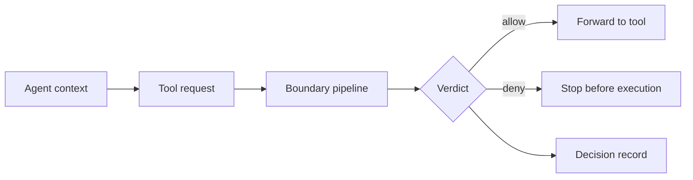

# Action Boundary

Boundary is narrow by design: it governs proposed privileged actions before
execution when those actions route through Boundary.

The core pipeline evaluates trust state, static policy, domain interceptors,
and portable PolicyEval rules. Direct access to the same upstream tool remains
a bypass unless the deployment topology removes that path.

Boundary consumes proof-backed contracts through documented correspondence and
decision-mode boundaries. It does not emit `proved` decisions itself.
