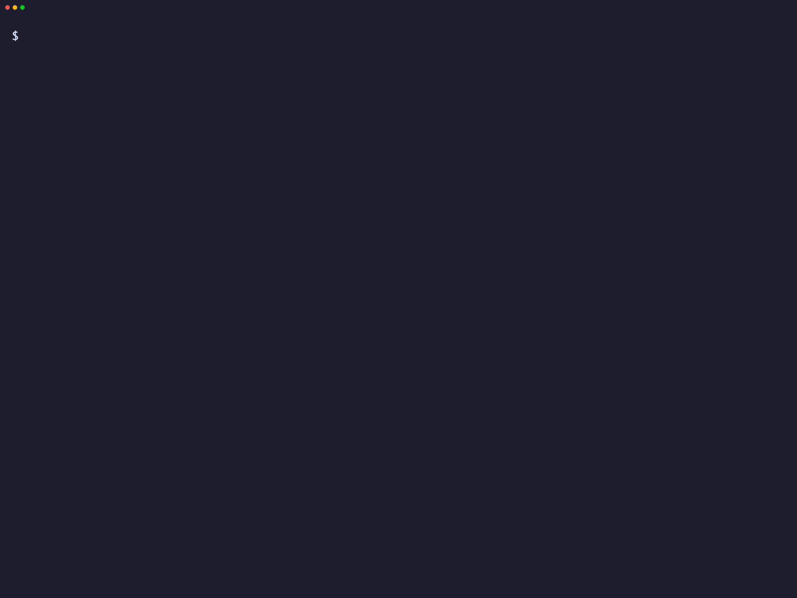

# Demo

The flagship local demo is the GitHub write-after-taint fixture.

## Exact Command

```bash
boundary demo github-lethal-trifecta
```

Expected success signal:

```text
actual action: DENY
reason: lethal_trifecta_detected
upstream_called=false
```


Static walkthrough of the fixture-safe GitHub write-after-taint demo.

## What It Proves

- Boundary can inventory a fixture GitHub MCP server.
- Boundary can render an untrusted GitHub issue to private-repo mutation risk
  path.
- Boundary can generate starter policies that parse through its verifier.
- Secure GitHub preview can deny the tested write-after-taint fixture before
  upstream GitHub mutation.
- Boundary emits a decision record for the governed route.

## What It Does Not Prove

- It does not prove protection against every malicious prompt.
- It does not make Secure GitHub a production surface.
- It does not call live GitHub or mutate a real repository.
- It does not protect tools that bypass Boundary.
- It does not prove production route enforcement.

## Terminal Receipt



The terminal receipt shows the local fixture command completing. It is not a
live GitHub run and does not prove production route enforcement.

## Source Doc

Read the canonical source demo doc:
[docs/DEMO_GITHUB_LETHAL_TRIFECTA.md](https://github.com/Fulcrum-Governance/Fulcrum-Boundary/blob/main/docs/DEMO_GITHUB_LETHAL_TRIFECTA.md).
