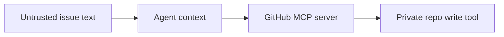

# Risk Graph

Risk graphs connect discovered sources, MCP servers, tools, and privileged
sinks into reviewable paths.

```bash
boundary graph --format mermaid
```



Risk graphs are visibility and policy-starting artifacts. They do not govern a
tool until traffic routes through Boundary.
