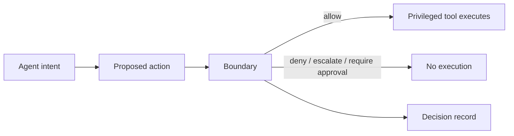

# Fulcrum Boundary

The action boundary for MCP-native agents.

```bash
go install github.com/fulcrum-governance/fulcrum-boundary/cmd/boundary@main
boundary selftest
boundary demo github-lethal-trifecta
```

Boundary inventories local MCP tool paths, renders risk paths, generates
starter policies, runs safe fixture redteams, and denies governed privileged
actions before execution when those actions route through Boundary.



## Current Release Truth

- MCP is the production adapter.
- CLI, CodeExec, gRPC, Managed Agents, Webhook, A2A, and Secure GitHub are
  preview adapter/profile surfaces.
- Secure GitHub is fixture-backed until live GitHub App conformance and
  deployment bypass evidence are recorded.
- Generated policies are starter policies for operator review.
- The dashboard is local-only artifact visibility.
- Boundary governs routed tools; direct tool access is outside the governed
  route.

## Pages Status

This docs site is a buildable repository artifact. Publication depends on the
repository GitHub Pages settings and the `Docs` workflow completing on `main`.
